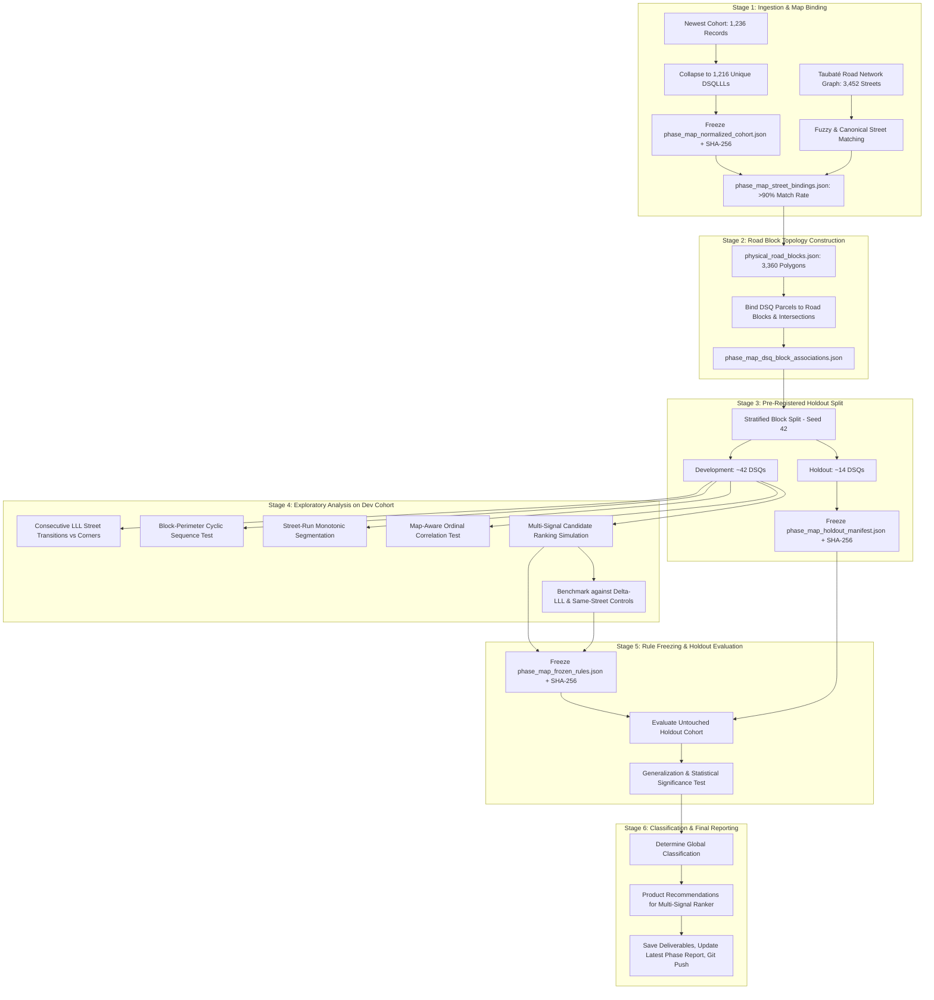

# Implementation Plan — Phase Map-Aware LLL Block-Perimeter Validation
## Physical Road-Block Topology, Corner Transitions & Multi-Signal Candidate Ranking

## 1. Problem Statement & Scientific Objective

In Phase LLL Spatial Sequentiality Validation, we established that within Taubaté cadastral blocks (`D.S.QQQ`):
- Immediate lot neighbors ($\Delta\text{LLL} = 1$) share the same street **65.6%** of the time with a median door number difference of **10 units**.
- Along a single street face, lot numbers and house numbers exhibit high ordinal alignment (median Spearman $|\rho| = 1.00$).
- At tight local radii ($W \le 3$), anchor-centered windows provide **1.51x information lift** over a random same-block window, but at wide windows ($W = 23$, 47 candidates), discriminatory lift drops to **1.01x** because high recall is driven primarily by broad block coverage.

The core unresolved topological question for **Address Finder** is:
> **When the street name changes along a consecutive or near-consecutive LLL sequence (e.g. LLL $008 \rightarrow 009$), does this transition correspond to a physical corner/intersection of a real road block, or is it an arbitrary cadastral discontinuity?**

If cadastral lot numbering follows physical block perimeters (e.g. traversing Street A $\rightarrow$ corner $\rightarrow$ Street B $\rightarrow$ corner $\rightarrow$ Street C):
1. Consecutive street transitions will match physical road intersections at a rate significantly higher than chance.
2. The sequence of streets around a cadastral block will follow cyclic perimeter paths (clockwise or counter-clockwise).
3. A **multi-signal candidate ranker** combining $\Delta\text{LLL}$, road-network adjacency, and physical road-block topology can improve Top 5 and Top 10 target recall over pure $\Delta\text{LLL}$ alone.

This phase is **measurement and validation only**. It will **NOT** query protected municipal portals, solve CAPTCHAs, or execute Facade Checker.

---

## 2. User Review Required

> [!IMPORTANT]
> **Cohort Scope & Recomputed Counts**:
> Ingesting the newest available cohort (`acervo_casas_taubate.json` / `Acervo_Casas_Taubate_1000_Lotes.xlsx`) yields **1,236 raw records** (1,121 houses/sobrados, 115 vacant lots).
> - Valid BCs: **1,236 / 1,236 (100.0%)**.
> - Unique DSQs: **56 cadastral blocks**.
> - Unique `DSQLLL` spatial parcels: **1,216 parcels** (multi-unit condominium desdobros collapsed to parent parcels under the Anti-Condo Inflation Rule).
> - Real street addresses: **945 parcels** (291 vacant lots carry "Lote/Requerente" documentary text and 8 have empty addresses).
> - Numbered addresses: **841 parcels**.

> [!IMPORTANT]
> **Independent Road Network Source**:
> Road network geometry and physical block polygons are derived strictly from the existing verified OpenStreetMap Taubaté road network dataset (`road_network_taubate.json`, `physical_road_blocks.json`, `osm_taubate_roads_raw.json`).
> No municipal GIS portals will be queried.
> No geometry will be inferred from QQQ or LLL numbers.

> [!IMPORTANT]
> **Blind Holdout Protocol (Strict DSQ-Level Isolation)**:
> Cadastral blocks (`DSQ`) will be split into Development (~75%, ~42 DSQs) and Blind Holdout (~25%, ~14 DSQs) using deterministic stratified sampling (`SEED = 42`).
> All transition rules, perimeter scoring parameters, and multi-signal ranking weights will be frozen before opening holdout data.

---

## 3. End-to-End Pipeline Architecture

---

## 4. Methodological Components

### 4.1 Ingestion, Audit & Canonical Normalization
- **Input Source**: `acervo_casas_taubate.json` / `Acervo_Casas_Taubate_1000_Lotes.xlsx` (Audited: 1,236 records).
- **Canonical Fields**: `BC_RAW`, `BC_CANONICAL`, `D`, `S`, `QQQ`, `LLL`, `SSS`, `DS`, `DSQ`, `DSQLLL`, `STREET_RAW`, `STREET_NORMALIZED`, `HOUSE_NUMBER`, `NEIGHBORHOOD`, `PROPERTY_TYPE`, `LAND_AREA`, `BUILT_AREA`, `VALOR_VENAL_TOTAL`.
- **Anti-Condo Inflation Rule**: Multiple sub-lots under the same `DSQLLL` are collapsed into a single spatial parcel with `sublot_count` tracked.
- **Privacy Rule**: Contributor names are excluded from all deliverables.
- **Deliverables**: `phase_map_normalized_cohort.json`, `phase_map_source_manifest.json`, `phase_map_data_quality_report.json`.

### 4.2 Street-to-Road-Network Binding
- Match each unique normalized street name to `road_network_taubate.json` using:
  1. Exact canonical string match.
  2. Abbreviation expansion (e.g. "DR." $\rightarrow$ "DOUTOR", "CEL." $\rightarrow$ "CORONEL", "N SRA" $\rightarrow$ "NOSSA SENHORA").
  3. Token set Jaccard similarity ($\ge 0.60$) and Levenshtein distance ($\le 2$).
- Record for each street: `MAP_STREET_MATCHED`, `MATCH_CONFIDENCE` (`EXACT`, `HIGH_CONFIDENCE_FUZZY`, `UNMATCHED`), `ROAD_SEGMENT_IDS`, `DIRECT_INTERSECTIONS`.
- **Deliverable**: `phase_map_street_bindings.json`.

### 4.3 Physical Road-Block Construction
- Using `physical_road_blocks.json`, identify the physical road block polygon(s) associated with each DSQ.
- For each street in a DSQ, verify if it forms a perimeter edge of the same road block polygon.
- **Deliverable**: `phase_map_dsq_block_associations.json`.

### 4.4 Consecutive LLL Street Transitions vs Corners
- For all observed consecutive pairs $(\text{LLL}_n, \text{LLL}_{n+1})$ in Development DSQs:
  Classify into:
  - `SAME_STREET`
  - `DIFFERENT_STREET_INTERSECTING`: Street A and Street B physically intersect in the road network.
  - `DIFFERENT_STREET_NON_INTERSECTING`: Street A and Street B exist in the road network but do NOT intersect.
  - `MAP_UNRESOLVED`: One or both streets cannot be resolved to the road graph.
- Primary metric:
  $$P(\text{INTERSECTING\_STREET} \mid \text{consecutive LLL street change}) = \frac{N(\text{INTERSECTING})}{N(\text{INTERSECTING}) + N(\text{NON\_INTERSECTING})}$$
- Compare against larger numeric lot gaps: $\Delta \in \{2, 3, 4, 5, 6\text{--}10, >10\}$.
- **Deliverable**: `phase_map_consecutive_transitions.json`.

### 4.5 Block-Perimeter Sequence Test
- For qualifying DSQs ($\ge 5$ parcels, $\ge 2$ mapped perimeter streets forming a closed or semi-closed block polygon):
  - Extract physical perimeter street sequence $[S_1, S_2, \dots, S_k]$.
  - Extract observed LLL parcel street progression $[L_1, L_2, \dots, L_m]$.
  - Test cyclic consistency (allowing forward/clockwise and reverse/counter-clockwise traversals without fixed start point).
- Categorize each DSQ:
  - `PERIMETER_CONSISTENT`: LLL order strictly follows perimeter sequence.
  - `PERIMETER_PARTIALLY_CONSISTENT`: Follows perimeter with $\le 1$ jump or non-contiguous fill.
  - `PERIMETER_INCONSISTENT`: Street progression crosses opposite faces non-ordinally.
  - `UNRESOLVED`: Insufficient map topology to define cyclic perimeter.
- **Deliverable**: `phase_map_perimeter_sequences.json`.

### 4.6 Street-Run Segmentation & Map-Aware Ordinal Alignment
- Within each DSQ, identify contiguous runs of lots facing the same street.
- Re-run Spearman rank correlation ($\rho$) and Kendall tau ($\tau_b$) on:
  - Baseline: `(DSQ, STREET)`
  - Map-Aware: `(DSQ, MAP_SUPPORTED_RUN)`
- Measure whether map-aware run segmentation resolves anomalies caused by opposite-face loops.
- **Deliverable**: `phase_map_ordinal_correlations.json`.

### 4.7 Multi-Signal Candidate Ranking Simulation
- Simulate Address Finder anchor search on Development DSQs:
  Given known anchor parcel $i$ and target parcel $j$:
  Evaluate multi-signal candidate scoring function:
  $$\text{Score}(c) = w_1 \cdot \frac{1}{1 + \Delta\text{LLL}(i, c)} + w_2 \cdot \mathbb{I}(\text{SameStreet}) + w_3 \cdot \mathbb{I}(\text{IntersectingCorner}) + w_4 \cdot \mathbb{I}(\text{SameRoadBlock}) + w_5 \cdot \text{PerimeterProximity}(i, c)$$
- Evaluate target retrieval rank: Top 1, Top 3, Top 5, Top 10, Top 20.
- Compare against baselines:
  - **Baseline A**: Pure $\Delta\text{LLL}$ rank.
  - **Baseline B**: Same-street filter + $\Delta\text{LLL}$.
  - **Baseline C**: Random same-DSQ window (Control B).
- Measure Top 5 and Top 10 candidate list compression.
- **Deliverable**: `phase_map_candidate_rankings.json`.

### 4.8 Rule Freezing Protocol
- Freeze the multi-signal weights $(w_1, \dots, w_5)$ and classification thresholds based strictly on Development DSQs.
- Record frozen configuration in `phase_map_frozen_rules.json` and compute its SHA-256 before opening holdout data.

### 4.9 Blind Holdout Evaluation
- Open Holdout DSQs (~14 DSQs).
- Apply frozen scoring and evaluate:
  - Transition intersection rate.
  - Perimeter consistency rate.
  - Top 1, Top 3, Top 5, Top 10, Top 20 recall.
  - Compare Development vs Holdout stability.
- **Deliverable**: `phase_map_holdout_results.json`.

### 4.10 Global Classification & Recommendations
- Classify strictly as:
  - `MAP_AWARE_LLL_TOPOLOGY_HIGH_VALUE`: Transitions frequently map to real corners, perimeter progression replicates across holdout, and map-aware ranking materially improves Top 5/Top 10 recall over $\Delta\text{LLL}$ alone.
  - `MAP_AWARE_LLL_TOPOLOGY_PARTIAL_VALUE`: Geometric structure is confirmed, but candidate compression gain is moderate or confined to specific block topologies.
  - `MAP_AWARE_LLL_TOPOLOGY_LOW_VALUE`: Street transitions rarely match corners or map features do not improve ranking.
  - `INSUFFICIENT_MAP_COVERAGE`: Road network binding fails to resolve sufficient block perimeters.
- Produce final metrics summary in `phase_map_metrics_summary.json`.

---

## 5. Verification Plan

### Automated Execution & Artifact Generation
- Run master pipeline: `python scratch/run_phase_map_master.py`.
- Verify that all 10 JSON deliverables and their corresponding `.sha256` checksum files are produced in `facade-checker/data/address_finder_bc_anchors_v1/`.
- Validate that holdout manifest is hashed before exploratory models run, and frozen rules are hashed before holdout evaluation.
- Generate full reports:
  - `brain/address_finder/reports/PHASE_MAP_AWARE_LLL_BLOCK_PERIMETER_VALIDATION.md`
  - `brain/address_finder/LATEST_PHASE_REPORT.md`
  - `brain/address_finder/LATEST_PHASE_RESULTS.json`
- Commit and push to `origin main`.
- Conclude with `STOP_FOR_HUMAN_REVIEW`.
