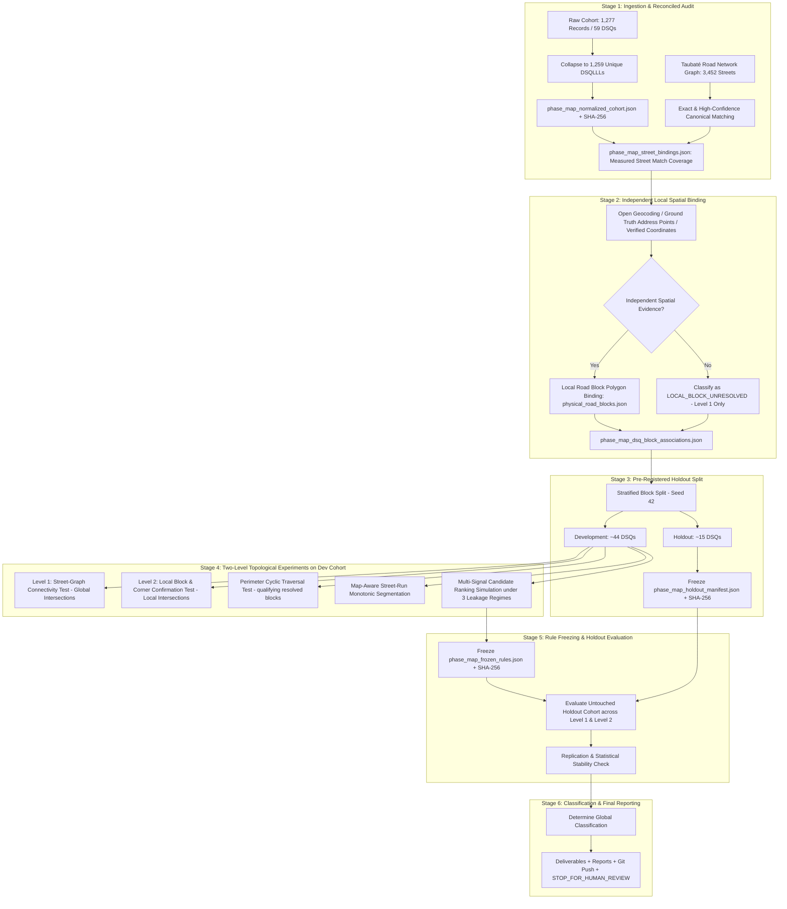

# Implementation Plan — Phase Map-Aware LLL Block-Perimeter Validation
## Physical Road-Block Topology, Corner Transitions & Multi-Signal Candidate Ranking

## 1. Problem Statement & Scientific Objective

In Phase LLL Spatial Sequentiality Validation, we established that within Taubaté cadastral blocks (`D.S.QQQ`):
- Immediate lot neighbors ($\Delta\text{LLL} = 1$) share the same street **65.6%** of the time with a median door number difference of **10 units**.
- Along a single street face, lot numbers and house numbers exhibit high ordinal alignment (median Spearman $|\rho| = 1.00$).
- At tight local radii ($W \le 3$), anchor-centered windows provide **1.51x information lift** over a random same-block window, but at wide windows ($W = 23$, 47 candidates), discriminatory lift drops to **1.01x** because high recall is driven primarily by broad block coverage.

The core topological hypothesis under test is:
> **Cadastral lot numbering (LLL) transitions between different streets within a block may reflect physical traversal around real road-block perimeters/corners rather than arbitrary cadastral discontinuities.**

To test this hypothesis rigorously without methodological confounders, the experiment must strictly separate:
1. **Level 1 — Street-Graph Topology**: Do Street A and Street B connect/intersect anywhere in the city road graph?
2. **Level 2 — Local Block Geometry**: Do the specific observed parcels belong to the physical block/corner where Street A and Street B intersect?

This phase is **measurement and validation only**. It will **NOT** query protected municipal portals, solve CAPTCHAs, or execute Facade Checker.

---

## 2. User Review Required & Methodological Corrections

> [!IMPORTANT]
> **Strict Separation of Evidence Levels (Graph vs Local Geometry)**:
> - A street name alone is insufficient to bind a cadastral DSQ or parcel to a specific physical road-block polygon because a street may span dozens of blocks across the city.
> - **Level 1 (Street Graph Test)** evaluates topological graph connectivity only (`SAME_STREET`, `DIFFERENT_STREET_GRAPH_INTERSECTING`, `DIFFERENT_STREET_GRAPH_NON_INTERSECTING`, `MAP_UNRESOLVED`). It does NOT prove a physical parcel corner.
> - **Level 2 (Local Block / Corner Test)** is evaluated **only** when independent spatial evidence is available (e.g. open address geocoding, verified coordinates from previous phases, independently mapped address points). Parcels lacking independent spatial positioning are classified as `LOCAL_BLOCK_UNRESOLVED`.

> [!IMPORTANT]
> **Reconciled Cohort Denominators**:
> Auditing the raw dataset (`acervo_casas_taubate.json` / `Acervo_Casas_Taubate_1000_Lotes.xlsx`) yields exact, mutually consistent counts:
> 
> | Category | Unique Spatial Parcels (DSQLLL) | Raw Records (BC) | Definition / Scope |
> | :--- | :---: | :---: | :--- |
> | **Street with House Number** | 847 | 858 | Valid parsed street name and valid positive integer door number |
> | **Street without House Number** | 93 | 94 | Valid parsed street name, but no house number (S/N, 0, or unnumbered) |
> | **Documentary-Text Vacant Lots** | 309 | 314 | Certidão venal description (e.g. 'LOTE X QD Y', 'REQUERENTE...') |
> | **Empty Address** | 10 | 11 | Missing or blank address fields |
> | **Total Cohort** | **1,259** | **1,277** | **59 Unique Cadastral Blocks (DSQ)** |
> 
> *Note: Multi-unit desdobros (SSS) are collapsed to 1,259 unique DSQLLL spatial parcels under the Anti-Condo Inflation Rule.*

> [!IMPORTANT]
> **Ambiguous Street Matching Protocol**:
> No forced fuzzy matches. Every street binding is classified as `EXACT`, `HIGH_CONFIDENCE_UNIQUE`, `AMBIGUOUS`, or `UNMATCHED`.
> If multiple OpenStreetMap ways/streets remain plausible after canonical normalization, the match is classified as `AMBIGUOUS`. A manual audit sample of fuzzy matches will be reported.

> [!IMPORTANT]
> **Candidate Ranker Simulation & Anti-Leakage Labels**:
> To prevent misleading claims about production capability, ranking experiments are strictly partitioned by target street visibility:
> 1. `NO_TARGET_STREET`: Realistic cold search (only anchor position and numeric LLL available).
> 2. `LISTING_STREET_AVAILABLE`: Realistic scenario where property listing exposes target street name.
> 3. `ORACLE_TARGET_STREET`: Upper-bound theoretical benchmark where true target street is known.
> *Features relying on physical block geometry (`SameRoadBlock`, `PerimeterProximity`) are restricted strictly to candidates with independent local spatial binding.*

---

## 3. End-to-End Pipeline Architecture

---

## 4. Methodological Components

### 4.1 Ingestion, Audit & Canonical Normalization
- **Input Sources**: `acervo_casas_taubate.json` / `Acervo_Casas_Taubate_1000_Lotes.xlsx` (Audited: 1,277 records, 1,259 unique `DSQLLL` parcels, 59 `DSQs`).
- **Canonical Fields**: `BC_RAW`, `BC_CANONICAL`, `D`, `S`, `QQQ`, `LLL`, `SSS`, `DS`, `DSQ`, `DSQLLL`, `STREET_RAW`, `STREET_NORMALIZED`, `HOUSE_NUMBER`, `NEIGHBORHOOD`, `PROPERTY_TYPE`, `LAND_AREA`, `BUILT_AREA`, `VALOR_VENAL_TOTAL`.
- **Anti-Condo Inflation Rule**: All sub-lots (SSS) sharing the same `DSQLLL` are collapsed to 1 spatial parcel.
- **Privacy Rule**: Contributor names are excluded from all deliverables.
- **Deliverables**: `phase_map_normalized_cohort.json`, `phase_map_source_manifest.json`, `phase_map_data_quality_report.json`.

### 4.2 Street-to-Road-Network Binding & Ambiguity Handling
- Match normalized street strings against `road_network_taubate.json` (3,452 streets):
  - `EXACT`: Identical normalized string.
  - `HIGH_CONFIDENCE_UNIQUE`: Single unambiguous match after standard abbreviation expansion (e.g. 'DR.' $\rightarrow$ 'DOUTOR') with token Jaccard $\ge 0.75$.
  - `AMBIGUOUS`: Multiple plausible OSM candidates or score ties; retained without forced selection.
  - `UNMATCHED`: No plausible match in the OSM graph.
- Report measured street match coverage and audit sample for fuzzy matches.
- **Deliverable**: `phase_map_street_bindings.json`.

### 4.3 Independent Local Block Spatial Binding
- Link parcels and DSQs to physical road block polygons (`physical_road_blocks.json`) **only** when supported by independent spatial evidence:
  - Verified coordinates from previous phases,
  - Open street address geocoding / mapped points.
- If no independent local positioning exists, record as `LOCAL_BLOCK_UNRESOLVED`.
- Never infer block geometry from QQQ, LLL, or street name alone.
- **Deliverable**: `phase_map_dsq_block_associations.json`.

### 4.4 Two-Level Consecutive LLL Street Transition Experiments
For all consecutive pairs ($\text{LLL}_n, \text{LLL}_{n+1}$) in Development DSQs:

#### Level 1: Street-Graph Topology Test (Global Connectivity)
Classify each consecutive street change into:
- `SAME_STREET`
- `DIFFERENT_STREET_GRAPH_INTERSECTING`: Streets A and B intersect anywhere in Taubaté.
- `DIFFERENT_STREET_GRAPH_NON_INTERSECTING`: Streets A and B exist in road graph but do not intersect.
- `MAP_UNRESOLVED`: One or both streets are `UNMATCHED` or `AMBIGUOUS`.

#### Level 2: Local Block / Corner Test (Physical Corner Confirmation)
Evaluated strictly on parcels/DSQs with verified local block binding:
- `LOCAL_CORNER_CONFIRMED`: Streets A and B intersect at a node bounding the parcel's physical road block polygon.
- `LOCAL_CORNER_NOT_CONFIRMED`: Streets change within the same block without matching a bounding intersection.
- `LOCAL_BLOCK_UNRESOLVED`: Parcels lack independent spatial positioning.

Primary metrics:
$$P(\text{GRAPH\_INTERSECTING} \mid \Delta\text{LLL}=1 \text{ street change})$$
$$P(\text{LOCAL\_CORNER\_CONFIRMED} \mid \Delta\text{LLL}=1 \text{ street change and resolved block})$$
Compare against larger lot gaps: $\Delta \in \{2, 3, 4, 5, 6\text{--}10, >10\}$.
- **Deliverable**: `phase_map_consecutive_transitions.json`.

### 4.5 Block-Perimeter Sequence Test
- For qualifying DSQs with verified physical road block geometry and $\ge 2$ mapped perimeter faces:
  - Extract the physical cyclic sequence of boundary edges $[S_1, S_2, \dots, S_k]$.
  - Extract observed LLL parcel street progression $[L_1, L_2, \dots, L_m]$.
  - Test cyclic consistency (allowing forward/clockwise and reverse/counter-clockwise traversals without fixed start point).
- Classifications:
  - `PERIMETER_CONSISTENT`: LLL order strictly follows perimeter sequence.
  - `PERIMETER_PARTIALLY_CONSISTENT`: Follows perimeter with $\le 1$ jump.
  - `PERIMETER_INCONSISTENT`: Crosses opposite faces non-ordinally.
  - `LOCAL_BLOCK_UNRESOLVED`: Insufficient independent local geometry.
- **Deliverable**: `phase_map_perimeter_sequences.json`.

### 4.6 Street-Run Segmentation & Map-Aware Ordinal Alignment
- Within each DSQ, identify contiguous runs of lots facing the same street face.
- Re-run Spearman rank correlation ($\rho$) and Kendall tau ($\tau_b$) on:
  - Baseline: `(DSQ, STREET)`
  - Map-Aware: `(DSQ, MAP_SUPPORTED_RUN)`
- Measure whether separating disconnected runs on the same street resolves monotonicity reversals.
- **Deliverable**: `phase_map_ordinal_correlations.json`.

### 4.7 Multi-Signal Candidate Ranking Simulation
- Simulate Address Finder anchor search on Development DSQs under 3 distinct information regimes:
  1. `NO_TARGET_STREET`: $\text{Score}(c) = \frac{1}{1 + \Delta\text{LLL}(i, c)}$
  2. `LISTING_STREET_AVAILABLE`: $\text{Score}(c) = w_1 \cdot \frac{1}{1 + \Delta\text{LLL}(i, c)} + w_2 \cdot \mathbb{I}(\text{SameStreet}_{i, c}) + w_3 \cdot \mathbb{I}(\text{GraphIntersect}_{i, c})$
  3. `ORACLE_TARGET_STREET`: Target street is known with certainty; incorporates local block features when available.
- Features `SameRoadBlock` and `PerimeterProximity` are evaluated **only** where candidates have independent local block binding.
- Compare against:
  - **Baseline A**: Pure $\Delta\text{LLL}$ rank.
  - **Baseline B**: Same-street filter + $\Delta\text{LLL}$.
  - **Baseline C**: Random same-DSQ window (Control B).
- Measure Top 1, Top 3, Top 5, Top 10, and Top 20 target recall.
- **Deliverable**: `phase_map_candidate_rankings.json`.

### 4.8 Pre-Registered Rule Freezing Protocol
- Freeze multi-signal weights and threshold parameters based strictly on Development DSQs.
- Record in `phase_map_frozen_rules.json` and compute its SHA-256 before opening holdout data.

### 4.9 Blind Holdout Evaluation
- Open Holdout DSQs (~15 DSQs).
- Apply frozen scoring across Level 1 (graph) and Level 2 (local block) metrics.
- Evaluate Top 1..20 target recall and stability across Dev vs Holdout.
- **Deliverable**: `phase_map_holdout_results.json`.

### 4.10 Global Classification & Scientific Conclusions
- Permitted classifications:
  - `MAP_AWARE_LLL_TOPOLOGY_HIGH_VALUE`: High Level 2 local corner confirmation rate, perimeter traversal replicates across blind holdout DSQs with independent spatial evidence, and map-aware ranking materially improves candidate compression over pure $\Delta\text{LLL}$ ranking.
  - `MAP_AWARE_LLL_TOPOLOGY_PARTIAL_VALUE`: Geometric signal is present but candidate compression gain is moderate or confined to specific block topologies.
  - `MAP_AWARE_LLL_TOPOLOGY_LOW_VALUE`: Transitions rarely match physical corners or map features do not improve ranking.
  - `INSUFFICIENT_MAP_COVERAGE`: Road network or local spatial binding fails to resolve sufficient block perimeters.
- Produce consolidated metrics in `phase_map_metrics_summary.json`.

---

## 5. Verification Plan

### Automated Execution & Artifact Generation
- Pipeline script: `python scratch/run_phase_map_master.py`.
- Verify all 10 JSON deliverables and `.sha256` checksums in `facade-checker/data/address_finder_bc_anchors_v1/`.
- Validate pre-registered holdout hash and frozen rule hash timestamps.
- Generate full reports:
  - `brain/address_finder/reports/PHASE_MAP_AWARE_LLL_BLOCK_PERIMETER_VALIDATION.md`
  - `brain/address_finder/LATEST_PHASE_REPORT.md`
  - `brain/address_finder/LATEST_PHASE_RESULTS.json`
- Commit and push to `origin main`.
- Conclude with `STOP_FOR_HUMAN_REVIEW`.
