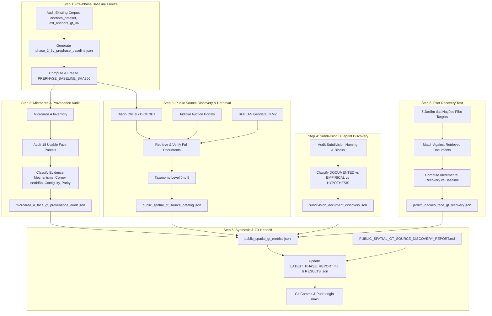

# Implementation Plan — Phase Address Finder 2.3Y (Approved with Methodological Addendum)
## Public Spatial Ground-Truth Source Discovery

## 1. Context & Scientific Imperative

In **Phase Address Finder 2.3X3**, the cross-microarea replication was stopped under the Feasibility Gate (`MICROAREA_B_FACE_GT_INSUFFICIENT`). The audit proved that across all 25,271 candidate microareas outside Barranco (`CAND-MICRO-14585`), the offline repository contains **0 candidate parcels with usable Street-Face Ground Truth** (`USABLE_FACE_DSQLLL = 0`). The 6 candidate parcels in Jardim das Nações (`CAND-MICRO-06598` / `05186`) and 5 in Vila São Geraldo (`CAND-MICRO-27948`) were documented only at `STREET_ONLY` resolution.

**Phase 2.3Y** is strictly a **Source Discovery and Provenance Audit** phase. Per the foundational scientific directive:
- **No topology modeling or replication will be run in this phase**.
- Any recovered Face-GT will be cataloged and frozen for separate future evaluation.

---

## 2. Approved Methodological Addenda

### Addendum 1: Rigorous Classification of Subdivision-to-QQQ Relationships
Prior observations (e.g. Bosque Flamboyant Quadras R, S, T $\leftrightarrow$ QQQs 206, 207, 208) must **not** be treated as established universal laws or used to locate physical parcels. Every subdivision block relationship must be classified as one of:
- `DOCUMENTED_RELATION`: directly supported by an independent, public documentary record linking the specific cadastral QQQ to the subdivision block name/letter;
- `LOCAL_EMPIRICAL_ASSOCIATION`: an observed empirical co-occurrence within an audited micro-area without independent external documentary proof;
- `HYPOTHESIS_TO_VERIFY`: an unproven structural hypothesis.

Each record must store: `SUBDIVISION_NAME`, `SUBDIVISION_BLOCK_ID`, `CADASTRAL_QQQ`, `RELATION_STATUS`, `SOURCE_DOCUMENT`, `SOURCE_TYPE`, `INDEPENDENT_OF_BC_TOPOLOGY_MODEL`, `CONFIDENCE`.

### Addendum 2: Strict Pre-Phase Baseline Freeze
To prevent retrospective inflation of recovery rates, a pre-phase baseline file:
`facade-checker/data/address_finder_bc_anchors_v1/phase_2_3y_prephase_baseline.json`
must be written and frozen with `PREPHASE_BASELINE_SHA256` **before** registering new discoveries. It records the exact pre-phase known state for:
- All 22 Microarea A DSQLLLs;
- The 6 Jardim das Nações pilot parcels;
- All previously known URLs, documents, house numbers, lot IDs, and face levels.

### Addendum 3: Total vs Incremental Metrics
The phase metrics must strictly distinguish pre-existing knowledge from newly discovered evidence:
- `TOTAL_SOURCE_LINKS_FOUND` vs `NEW_SOURCE_LINKS_FOUND` vs `REDISCOVERED_SOURCE_LINKS`
- `TOTAL_BC_TO_ADDRESS_LINKS` vs `NEW_BC_TO_ADDRESS_LINKS`
- `TOTAL_BC_TO_LOT_LINKS` vs `NEW_BC_TO_LOT_LINKS`
- `TOTAL_BC_TO_FACE_LINKS` vs `NEW_BC_TO_FACE_LINKS`
- `TOTAL_BC_TO_PARCEL_GEOMETRY_LINKS` vs `NEW_BC_TO_PARCEL_GEOMETRY_LINKS`
- For pilot parcels: `POST_PHASE_USABLE_FACE_GT` and `INCREMENTAL_USABLE_FACE_GT`.

An increment is valid **only** if the post-phase evidence is strictly stronger than the frozen pre-phase baseline.

### Addendum 4: Source Authenticity & Verification
Every source used for spatial GT must cite: `SOURCE_URL`, `SOURCE_TITLE`, `SOURCE_TYPE`, `PUBLIC_ACCESS_STATUS`, `DOCUMENT_DATE`, `DOCUMENT_IDENTIFIER`, `RETRIEVAL_TIMESTAMP`, and `CONTENT_HASH_IF_DOWNLOADED`. Search-engine snippets alone are never treated as final Ground Truth.

---

## 3. Workflow & Component Architecture

---

## 4. Deliverables Manifest

1. `facade-checker/data/address_finder_bc_anchors_v1/phase_2_3y_prephase_baseline.json`
2. `facade-checker/data/address_finder_bc_anchors_v1/microarea_a_face_gt_provenance_audit.json`
3. `facade-checker/data/address_finder_bc_anchors_v1/public_spatial_gt_source_catalog.json`
4. `facade-checker/data/address_finder_bc_anchors_v1/subdivision_document_discovery.json`
5. `facade-checker/data/address_finder_bc_anchors_v1/jardim_nacoes_face_gt_recovery.json`
6. `facade-checker/data/address_finder_bc_anchors_v1/public_spatial_gt_metrics.json`
7. `brain/address_finder/reports/PHASE_2.3Y_PUBLIC_SPATIAL_GT_SOURCE_DISCOVERY.md`
8. `brain/address_finder/LATEST_PHASE_REPORT.md`
9. `brain/address_finder/LATEST_PHASE_RESULTS.json`
