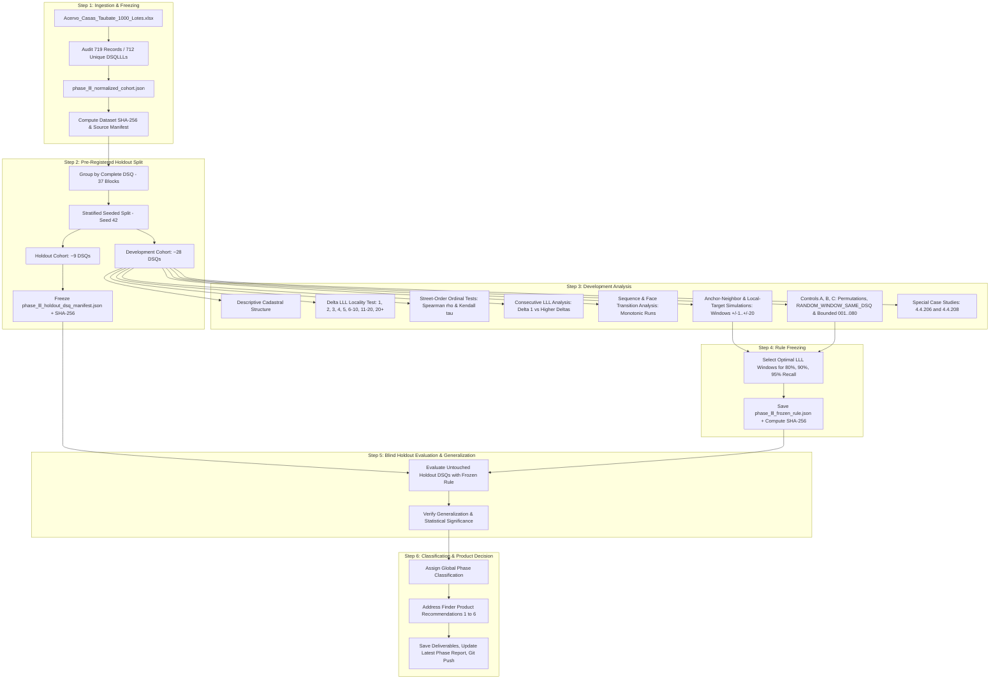

# Implementation Plan — Phase LLL Spatial Sequentiality Validation
## 588-Property Cadastral Cohort Validation & Compression Simulation

## 1. Problem Statement & Scientific Objective

In the Taubaté municipal cadastral identifier system:
$$\text{BC} = \text{D} . \text{S} . \text{QQQ} . \text{LLL} . \text{SSS}$$
where:
- $\text{D.S}$ denotes District and Sub-district,
- $\text{QQQ}$ denotes the cadastral sector/block,
- $\text{LLL}$ denotes the cadastral lot identifier within the cadastral block. Whether its numeric ordering carries local spatial/ordinal information is the hypothesis under test,
- $\text{SSS}$ denotes the sub-lot/condominium unit.

The primary engineering question for **Address Finder** is:
> **Given a known cadastral/spatial anchor inside or near a target area, can nearby lot numbers ($\text{LLL}$) predict spatial proximity and reduce the candidate search space while preserving high target recall ($\ge 80\%$, $\ge 90\%$, $\ge 95\%$)?**

Prior Address Finder approaches relied on naive bounded generation (e.g. searching all lot indices from $001$ to $080$, generating up to 80 candidate parcels per block). If cadastral lot assignment within a block is spatially ordinal (e.g. following road axes, consecutive lot layouts, or street frontages), local windows:
$$\text{LLL}_{\text{anchor}} \pm W \quad (W \in \{1, 2, 3, 5, 10\})$$
can dramatically compress candidate queries (e.g. from 80 down to 7–11 candidates) while capturing target parcels.

This phase is **measurement and validation only**. It will **NOT** integrate candidate generation into Address Finder production code, and will **NOT** execute Facade Checker or scrape portals.

---

## 2. User Review Required

> [!IMPORTANT]
> **Dataset Ingestion & Audit**:
> The primary raw cohort is supplied in `Acervo_Casas_Taubate_1000_Lotes.xlsx` (`SHA-256: 079e948dfdffc8c2f84f3a911fa6c31b44f11efae4ac7ccedb9323fb29a04169`).
> Auditing reveals **719 property records** (647 houses/sobrados and 72 vacant lots, spanning 37 distinct DSQs and 712 unique DSQLLLs), exceeding the nominal ~588 estimate. In compliance with Section 1 ("Do not assume these counts are correct. Recompute everything from the raw file"), the exact 719 records will be parsed, cleaned, and audited without modifying the raw spreadsheet.

> [!IMPORTANT]
> **Spatial Unit of Analysis (Anti-Condo Inflation Rule)**:
> Multiple sub-lot units ($\text{SSS}$) belonging to the same physical lot ($\text{DSQLLL}$) share identical spatial parcel boundaries. They must **NOT** be treated as independent spatial parcels. All spatial sequentiality, locality, and correlation metrics will operate strictly on the **712 unique $\text{DSQLLL}$ parcels**.

> [!IMPORTANT]
> **Pre-Registered Blind Holdout Split (Strict Block Isolation)**:
> The split will be performed **strictly by complete DSQ (cadastral block)**. No parcels from the same block will appear in both development and holdout.
> - **Holdout Cohort**: ~20–25% of DSQs (8–9 DSQs), selected via deterministic stratified sampling (`SEED = 42`) across parcel volume tiers.
> - **Development Cohort**: ~75–80% of DSQs (28–29 DSQs).
> - The holdout manifest (`phase_lll_holdout_dsq_manifest.json`) will be frozen and hashed before running exploratory models. Holdout metrics will remain strictly unopened until the candidate window rule is frozen.

---

## 3. End-to-End Pipeline Architecture

---

## 4. Methodological Components & Verification Protocols

### 4.1 Ingestion, Canonical Normalization & Quality Audit
- **Input File**: `Acervo_Casas_Taubate_1000_Lotes.xlsx` (Raw SHA-256: `079e948dfdffc8c2f84f3a911fa6c31b44f11efae4ac7ccedb9323fb29a04169`).
- **Normalized Canonical Fields**:
  - `BC_RAW`, `BC_CANONICAL` (`D.S.QQQ.LLL.SSS`)
  - `D`, `S`, `QQQ`, `LLL` (integer and zero-padded 3-digit string), `SSS`
  - `DS`, `DSQ`, `DSQLLL`
  - `STREET_RAW`, `STREET_NORMALIZED` (stripped of prefix acronyms, punctuation, accented characters)
  - `HOUSE_NUMBER` (integer when valid positive number, `null` when S/N or `00000`)
  - `NEIGHBORHOOD` (bairro/loteamento)
  - `PROPERTY_TYPE` (House/Sobrado, Land, Apartment, Commercial, Other)
  - `LAND_AREA`, `BUILT_AREA`, `VALOR_VENAL_TOTAL`
  - *Privacy Safeguard*: Contributor/person names are strictly excluded from all analytical payloads and outputs.
- **Audit Deliverable**: `phase_lll_data_quality_report.json`.

### 4.2 Pre-Registered Blind Holdout Partitioning
- **Grouping Key**: Complete `DSQ` (`D.S.QQQ`).
- **Target Proportions**:
  - Development: 75%–80% of DSQs (~28 DSQs).
  - Holdout: 20%–25% of DSQs (~9 DSQs).
- **Stratification**: DSQs stratified into 3 density tiers based on distinct parcel count:
  - Low ($N < 10$)
  - Medium ($10 \le N < 25$)
  - High ($N \ge 25$)
- **Deterministic Sampling**: Python `hashlib.sha256` or seeded pseudo-random generator with fixed seed `SEED = 42`.
- **Pre-Registration Freeze**: Save `phase_lll_holdout_dsq_manifest.json` and report its SHA-256 in the implementation report before running exploratory tests.

### 4.3 Descriptive Cadastral Structure (Development DSQs Only)
For each DSQ in the Development cohort:
- Distinct `LLL` count, $\min(\text{LLL})$, $\max(\text{LLL})$, total span $(\max - \min + 1)$.
- Number of distinct normalized streets.
- Parcels per street.
- Observed consecutive `LLL` pairs $(\text{LLL}_i, \text{LLL}_{i+1})$.
- Observed gaps in numeric series.
- Property type composition.
- Frequency distribution across DSQ size thresholds (DSQs with $\ge 3$, $\ge 5$, $\ge 10$, $\ge 20$ parcels).

### 4.4 Primary Test — $\Delta\text{LLL}$ Locality
For every pair of distinct parcels $(A, B)$ within the same DSQ:
$$\Delta\text{LLL} = |\text{LLL}_A - \text{LLL}_B|$$
Binned into:
$$\Delta \in \{1, 2, 3, 4, 5, 6\text{--}10, 11\text{--}20, >20\}$$
Metrics computed per bin:
- **Total Pair Count** (raw $N$).
- **Same Street Rate**: fraction of pairs sharing identical `STREET_NORMALIZED`.
- **Same Neighborhood Rate**: fraction sharing identical `NEIGHBORHOOD`.
- **House-Number Distance**: mean and median $|\text{HouseNumber}_A - \text{HouseNumber}_B|$ for pairs with valid numeric door numbers.
- **Hypothesis Evaluation**: Does physical/street closeness monotonically decay as $\Delta\text{LLL}$ increases?

### 4.5 Street-Order Test (Ordinal Alignment)
For each `(DSQ, STREET_NORMALIZED)` group with $\ge 3$ numbered parcels:
- Compute **Spearman Rank Correlation ($\rho$)** between `LLL` vector and `HOUSE_NUMBER` vector.
- Compute **Kendall Rank Correlation ($\tau$)** between `LLL` vector and `HOUSE_NUMBER` vector.
- Track both signed value and absolute magnitude $|\rho|$, $|\tau|$ (accounting for increasing vs decreasing cadastral directions).
- Aggregate metrics:
  - Median $|\rho|$, Median $|\tau|$.
  - Fractions with $|\rho| \ge 0.50$, $|\rho| \ge 0.70$, $|\rho| \ge 0.90$, $|\rho| \ge 0.99$.
  - Subgroup breakdown: $N \in [3, 4]$, $N \in [5, 7]$, $N \ge 8$.

### 4.6 Consecutive LLL Test
Detailed analysis of observed immediate neighbors $\text{LLL}_n$ and $\text{LLL}_{n+1}$ ($\Delta=1$):
- Same street rate.
- House-number difference distribution.
- Property type continuity vs transition.
- Frequency of street change transitions.
- Direct contrast against $\Delta = 2, 3, 4, 5, 10+$.

### 4.7 Sequence & Face Transition Analysis
- Extract high-density DSQs and compile human-readable run sequences:
  - `DSQ | LLL | STREET | HOUSE_NUMBER | PROPERTY_TYPE`
- Categorize sequences into:
  - Monotonic increasing runs.
  - Reversed runs.
  - `OBSERVED_STREET_TRANSITION` (points where LLL series changes street).
  - Cadastral gaps (missing LLL numbers).

### 4.8 Anchor-Neighbor & Local-Target Simulations
- **Global Anchor Simulation**:
  - Each parcel $i$ is designated as anchor.
  - Candidate windows evaluated:
    $$\mathcal{W} \in \{\pm 1, \pm 2, \pm 3, \pm 4, \pm 5, \pm 7, \pm 10, \pm 15, \pm 20\}$$
  - Measure:
    1. **Target Recall**: fraction of co-DSQ parcels captured within $[\text{LLL}_{\text{anchor}} - W, \text{LLL}_{\text{anchor}} + W]$.
    2. **Structural Hypothetical Candidate Count**: $|[\text{LLL}_{\text{anchor}} - W, \text{LLL}_{\text{anchor}} + W]| = 2W + 1$ (bounded at $\min=1$).
    3. **Observed Real DSQLLL Count**: actual number of occupied lots captured.
- **Local-Target Subsets (Realistic Operational Scenarios)**:
  - **Subset A**: Target is on the **same street** as anchor.
  - **Subset B**: **HOUSE_NUMBER_PROXIMITY_PROXY_50** ($|\Delta\text{Num}| \le 50$, ordinal proxy only, not physical meters).
  - **Subset C**: **HOUSE_NUMBER_PROXIMITY_PROXY_100** ($|\Delta\text{Num}| \le 100$, ordinal proxy only, not physical meters).
  - Determine minimum window $W$ achieving $\ge 80\%$, $\ge 90\%$, and $\ge 95\%$ recall.

### 4.9 Baseline & Control Comparisons
- **Control A (Random LLL Permutation)**: Randomly shuffle the `LLL` assignments within each DSQ across 100 iterations. Compute the expected locality and recall curves under null ordinal alignment.
- **Control B (RANDOM_WINDOW_SAME_DSQ)**: For each evaluated anchor/target setting, compare the real anchor-centered LLL window against a randomly positioned window of identical candidate width inside the same DSQ/numeric LLL domain.
- **Control C (Naive Bounded Generation)**: Traditional Address Finder baseline generating all $001\dots 080$ lots (burden = 80 candidates).
- Calculate **Candidate Reduction Ratio** and **Information Lift** ($P(\text{hit} \mid \text{LLL window}) / P(\text{hit} \mid \text{Random window})$).

### 4.10 Special Case Studies
- **Case Study 1: DSQ 4.4.206 (Rua Antônio Delgado da Veiga)**:
  - Evaluate the observed sequence from Lote 002 to Lote 020.
  - Correlate LLL against door numbers ($00020\dots 00160$).
- **Case Study 2: DSQ 4.4.208 (Bosque Flamboyant / Lavadouro de Areia)**:
  - Incorporate the newly collected official certidão data ($001\dots 008$) alongside the external anchor Varandas da Mantiqueira (`4.4.208.004.002`, R. Melchior Félix Corrêa, 210).
  - Explicitly keep external anchor separate from global statistical classification.

### 4.11 Rule Freezing Protocol
- Based strictly on Development results, select:
  - $W_{80}$ (window for ~80% local recall)
  - $W_{90}$ (window for ~90% local recall)
  - $W_{95}$ (window for ~95% local recall)
- Document the selected rules in `phase_lll_frozen_rule.json`.
- Compute `FROZEN_RULE_SHA256` **before** evaluating any holdout DSQs.

### 4.12 Blind Holdout Test
- Apply the frozen rule to the untouched Holdout DSQs.
- Evaluate:
  - Same-street locality by $\Delta\text{LLL}$.
  - Median Spearman $\rho$ and Kendall $\tau$.
  - Recall@W ($W \in \{1, 3, 5, 10, 20\}$).
  - Compare Development vs Holdout to assess stability and prevent overfitting.

### 4.13 Global Phase Classification
Select strictly from the pre-registered classifications:
- `LLL_SPATIAL_SEQUENTIALITY_STRONG_SIGNAL`: Strong ordinal/locality relationship, materially outperforms controls, and stably reproduces on holdout.
- `LLL_SPATIAL_SEQUENTIALITY_PARTIAL_SIGNAL`: Useful relationship exists, but varies materially across blocks/streets or holdout weakens.
- `LLL_SPATIAL_SEQUENTIALITY_NOT_SUPPORTED`: LLL distance provides negligible information beyond block containment.
- `INSUFFICIENT_DATA`: Cohort structure fails to support reliable inference.

### 4.14 Address Finder Product Recommendations
Provide clear, data-driven answers to the 6 core product questions:
1. Can a known BC be used as an ordinal LLL anchor?
2. What window sizes correspond to ~80%, ~90%, and ~95% local recall?
3. How many hypothetical candidates are generated per window?
4. How does this compare with the legacy 001..080 bounded generation?
5. Is the compression sufficient to justify an Address Finder candidate generator refactor?
6. Should the subsequent phase be a blinded real-listing test?

---

## 5. Deliverables & Artifact Inventory

The following structured files will be generated in `facade-checker/data/address_finder_bc_anchors_v1/`:
1. `phase_lll_normalized_cohort.json` (Canonical dataset)
2. `phase_lll_source_manifest.json` (Source hashes & metadata)
3. `phase_lll_holdout_dsq_manifest.json` (Holdout DSQ list + SHA-256)
4. `phase_lll_development_split.json` (Development parcels)
5. `phase_lll_holdout_split.json` (Holdout parcels)
6. `phase_lll_cadastral_structure.json` (DSQ-level descriptive stats)
7. `phase_lll_locality_metrics.json` (Delta LLL locality curves)
8. `phase_lll_street_order_correlations.json` (Spearman rho & Kendall tau)
9. `phase_lll_consecutive_analysis.json` (Delta=1 detailed metrics)
10. `phase_lll_sequence_runs.json` (Monotonic runs & street transitions)
11. `phase_lll_anchor_simulations.json` (Global and local-target recall curves)
12. `phase_lll_control_comparisons.json` (Permutation & bounded baseline metrics)
13. `phase_lll_special_cases.json` (Detailed audits of 4.4.206 and 4.4.208)
14. `phase_lll_frozen_rule.json` (Pre-registered frozen window rules)
15. `phase_lll_holdout_results.json` (Blind holdout evaluation metrics)
16. `phase_lll_metrics_summary.json` (Consolidated phase summary)

Reports in `brain/address_finder/`:
- `reports/PHASE_LLL_SPATIAL_SEQUENTIALITY_VALIDATION.md` (Historical report)
- `LATEST_PHASE_REPORT.md` (Active phase report)
- `LATEST_PHASE_RESULTS.json` (Active phase results)

---

## 6. Prohibitions & Scientific Constraints

- **No Protected Portal Queries**: Zero automation against municipal APEX or tributos portals.
- **No CAPTCHA Solving**: Captcha automation is strictly prohibited.
- **No Synthetic BC Fabrication**: Only real records from the raw file or verified historical case studies.
- **No Facade Checker Execution**: Street View and facade comparison remain completely decoupled.
- **No Holdout Leakage**: Zero inspection of holdout spatial outcomes during rule development.
- **No Ex-Post Threshold Adjustments**: Thresholds and window sizes cannot be tuned after observing holdout results.
