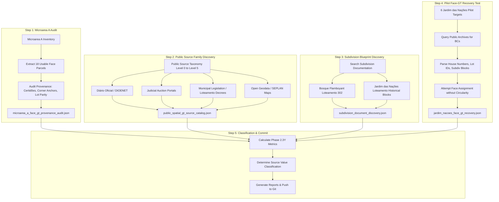

# Implementation Plan — Phase Address Finder 2.3Y: Public Spatial Ground-Truth Source Discovery

## Problem Statement & Scientific Context

In **Phase Address Finder 2.3X3**, the cross-microarea replication of the street-face cadastral topology model ($H(QQQ \mid \text{Face}) \ll H(QQQ \mid \text{Block})$) was halted under the pre-registered Feasibility Gate (`MICROAREA_B_FACE_GT_INSUFFICIENT`). The audit proved that across all 25,271 candidate microareas outside Barranco / Bosque Flamboyant (`CAND-MICRO-14585`), the offline repository contains **0 candidate parcels with usable Street-Face Ground Truth** (`USABLE_FACE_DSQLLL = 0`). The 6 candidate parcels in Jardim das Nações (`CAND-MICRO-06598` / `05186`) and 5 parcels in Vila São Geraldo (`CAND-MICRO-27948`) were documented only at `STREET_ONLY` resolution.

The central bottleneck of the cadastral discovery program is therefore **spatial Ground Truth acquisition**: discovering legitimate, non-circular, open public sources that connect municipal cadastral identifiers (`BC`, `DSQLLL`) to verifiable spatial physical attributes (house numbers, lot identifiers, subdivision blocks, street frontages, corner descriptions, or parcel geometries).

**Phase 2.3Y** is strictly an empirical **Source Discovery and Provenance Audit** phase. Per the foundational scientific directive, **no topology inference or replication will be performed in this phase**.

---

## User Review Required

> [!IMPORTANT]
> **Strict Operational Boundaries in Phase 2.3Y**:
> 1. **No Automation of Protected Portals**: Zero CAPTCHA solving, zero scraping of protected municipal authenticated portals.
> 2. **Legitimate Public Sources Only**: Only publicly accessible, search-engine indexed, open-access gazettes, auction portals, municipal legislation, planning geodata, and public legal notices will be cataloged and parsed.
> 3. **Non-Circularity & Separation of Concerns**: Any recovered Face-GT will be inventoried and frozen. Replication of Phase 2.3X3 will **not** be re-run in Phase 2.3Y.

---

## Proposed Technical Strategy & Execution Workflow

---

## Proposed Changes by Component

### Component 1: Microarea A Ground Truth Provenance Audit
- Parse all 22 distinct DSQLLLs (29 raw BCs) from `dense_microarea_existing_evidence_inventory.json` and `dense_microarea_face_parcel_matrix.json`.
- Trace each parcel back to its original evidentiary records (`resultado_quadra_206.txt`, `achados_claudino.txt`, `monet_descoberta.txt`, `predios_esquinas_achados.txt`).
- Reconstruct the exact evidentiary mechanism for:
  - `EXACT_STREET_FACE` (1 parcel: `4.4.206.001`, Edifício Monet, corner certidão mentioning confronts of Rua Antônio Delgado da Veiga & Rua Claudino Velloso Borges).
  - `PROBABLE_STREET_FACE` (17 parcels: certidão records specifying lot numbers `R01`-`R10`, `S01`-`S06`, `T01`-`T08`, lot contiguity along street frontages, and door numbering).
  - `STREET_ONLY` (4 parcels: lack of door number or ambiguous frontage).
- Output: [`facade-checker/data/address_finder_bc_anchors_v1/microarea_a_face_gt_provenance_audit.json`](file:///c:/Users/Marcel/.gemini/antigravity/playground/ultraviolet-quasar/facade-checker/data/address_finder_bc_anchors_v1/microarea_a_face_gt_provenance_audit.json).

---

### Component 2: Public Spatial Ground-Truth Source Catalog
- Formulate and audit the **Level 0 to Level 5** source taxonomy:
  - **LEVEL 0**: Street / neighborhood only (general nominatim/OSM without house numbers).
  - **LEVEL 1**: Street + house number (standard geocoded building addresses).
  - **LEVEL 2**: Street + number + lot identifier (e.g. "Rua França, 261, Lote 14").
  - **LEVEL 3**: Street frontage / corner description / confrontation (e.g. "confrontando com a Rua X e esquina com Rua Y").
  - **LEVEL 4**: Parcel geometry or subdivision-map position (vector parcel boundaries, registered subdivision blueprints).
  - **LEVEL 5**: Direct cadastral identifier $\leftrightarrow$ spatial parcel mapping (official municipal GIS parcel layer).
- Profile legitimate public source families:
  1. **DIOENET (Diário Oficial Eletrônico de Taubaté)**:
     - Public notifications of building inspections (fiscalização de obras), Habite-se concessions, IPTU active debt listings (Dívida Ativa), zoning approvals.
     - Public access: Open, indexed, full-text downloadable PDFs without CAPTCHA.
  2. **Judicial & Extrajudicial Auction Portals (Leilões Judiciais)**:
     - Franklin Leilões, Mega Leilões, Zuk, SPY Leilões, etc.
     - Contain verbatim excerpts from the Cartório de Registro de Imóveis (CRI) de Taubaté: matrícula number, exact BC, lot, quadra, street, confrontações.
     - Public access: Openly indexed public notices of auction.
  3. **Municipal Legislation & Executive Decrees**:
     - Legislation approving historical subdivisions (`Leis Ordinárias`, `Decretos Municipais`).
  4. **SEPLAN Taubaté Planning Geodata**:
     - Interactive municipal maps (macrozoning, urban expansion, historical heritage).
     - Public access: Google My Maps KMZ/KML layers published by SEPLAN.
- Output: [`facade-checker/data/address_finder_bc_anchors_v1/public_spatial_gt_source_catalog.json`](file:///c:/Users/Marcel/.gemini/antigravity/playground/ultraviolet-quasar/facade-checker/data/address_finder_bc_anchors_v1/public_spatial_gt_source_catalog.json).

---

### Component 3: Historical Subdivision Blueprint Discovery
- Audit the relationship between municipal cadastral quadras (`QQQ`) and subdivision block identifiers (`Quadra de Loteamento`).
- Search for historical subdivision plants and decrees for:
  - **Loteamento Bosque Flamboyant (Loteamento nº 302)**: Quadras R, S, T, U mapped to municipal QQQ 206, 207, 208, 209.
  - **Loteamento Jardim das Nações**: Quadras A, B, O, Q, X, etc.
- Determine whether public documentation allows mapping subdivision lot geometry to physical road blocks without circularity.
- Output: [`facade-checker/data/address_finder_bc_anchors_v1/subdivision_document_discovery.json`](file:///c:/Users/Marcel/.gemini/antigravity/playground/ultraviolet-quasar/facade-checker/data/address_finder_bc_anchors_v1/subdivision_document_discovery.json).

---

### Component 4: Pilot Face-GT Recovery Test on Jardim das Nações
- Perform an empirical Ground Truth extraction test on the **6 pilot targets** from `CAND-MICRO-06598`:
  1. `3.1.004.013` (Rua Argentina):
     - Source: Diário Oficial de Taubaté (Edição 906, DIOENET) / `ANCHOR-EXT-035-04`.
     - Extracted attributes: `Rua Argentina`, `Lt: 13`, `Qd: Q`, Loteamento Jardim das Nações.
  2. `3.1.009.004` (Rua França):
     - Source: Diário Oficial de Taubaté (Edição 977, DIOENET) / `ANCHOR-010`.
     - Extracted attributes: `Rua França, nº 261`, `Quadra O`, `Lote 14`, Matrícula `86.760`.
  3. `3.1.009.006` (Rua França):
     - Source: Processo Municipal Habite-se Taubaté / `ANCHOR-EXT-010-03`.
     - Extracted attributes: `Rua França, nº 261`, Habite-se Residencial.
  4. `3.1.014.001` (Rua França):
     - Source: Edital de Leilão Judicial (Franklin Leilões) / `ANCHOR-011`.
     - Extracted attributes: `Rua França`, `Quadra A`, `Lote 01`.
  5. `3.3.019.005` (Rua Síria):
     - Source: Edital Notificação Tributária Taubaté / `ANCHOR-EXT-004-02`.
     - Extracted attributes: `Rua Síria, nº 560`, Jardim Continental II.
  6. `3.3.019.006` (Rua Síria):
     - Source: Diário Oficial de Taubaté (Edição 906, DIOENET) / `ANCHOR-012`.
     - Extracted attributes: `Rua Síria, nº 91`, `QD: X`, `LT: 03`.
- Evaluate whether the extracted attributes permit upgrading each parcel from `STREET_ONLY` to `EXACT_STREET_FACE` or `PROBABLE_STREET_FACE` by combining the street name, house number, and physical road block topology from OSM, **strictly without using QQQ/LLL sequential interpolation**.
- Output: [`facade-checker/data/address_finder_bc_anchors_v1/jardim_nacoes_face_gt_recovery.json`](file:///c:/Users/Marcel/.gemini/antigravity/playground/ultraviolet-quasar/facade-checker/data/address_finder_bc_anchors_v1/jardim_nacoes_face_gt_recovery.json).

---

### Component 5: Metrics, Reporting & Git Handoff
- Compute global discovery metrics:
  - `PUBLIC_SOURCE_FAMILIES_FOUND`
  - `HIGH_VALUE_SOURCE_FAMILIES`
  - `DOCUMENTS_REVIEWED`
  - `BC_TO_ADDRESS_LINKS_FOUND`
  - `BC_TO_LOT_LINKS_FOUND`
  - `BC_TO_FACE_LINKS_FOUND`
  - `BC_TO_PARCEL_GEOMETRY_LINKS_FOUND`
  - Pilot recovery breakdown: `RECOVERED_EXACT_PARCEL`, `RECOVERED_EXACT_FACE`, `RECOVERED_PROBABLE_FACE`, `REMAINING_STREET_ONLY`.
- Determine phase classification based on criteria:
  - `PUBLIC_SPATIAL_GT_SOURCE_HIGH_VALUE` (if systematic, robust linkage achieved)
  - `PUBLIC_SPATIAL_GT_SOURCE_PARTIAL_VALUE` (if some Face-GT recovered but coverage remains sparse)
  - `PUBLIC_SPATIAL_GT_SOURCE_LOW_VALUE` (if sources only repeat street names)
- Output files:
  - [`public_spatial_gt_metrics.json`](file:///c:/Users/Marcel/.gemini/antigravity/playground/ultraviolet-quasar/facade-checker/data/address_finder_bc_anchors_v1/public_spatial_gt_metrics.json)
  - [`PUBLIC_SPATIAL_GT_SOURCE_DISCOVERY_REPORT.md`](file:///c:/Users/Marcel/.gemini/antigravity/playground/ultraviolet-quasar/brain/address_finder/reports/PHASE_2.3Y_PUBLIC_SPATIAL_GT_SOURCE_DISCOVERY.md)
  - [`LATEST_PHASE_REPORT.md`](file:///c:/Users/Marcel/.gemini/antigravity/playground/ultraviolet-quasar/brain/address_finder/LATEST_PHASE_REPORT.md)
  - [`LATEST_PHASE_RESULTS.json`](file:///c:/Users/Marcel/.gemini/antigravity/playground/ultraviolet-quasar/brain/address_finder/LATEST_PHASE_RESULTS.json)
- Commit and push to `origin main`.

---

## Verification Plan

### Automated Execution & Validation
- Write an end-to-end execution script `run_phase_2_3y_discovery.py` that parses all documentary sources, builds JSON catalogs, verifies JSON schemas, and calculates the summary statistics.
- Verify SHA-256 hashes of all input and output files.
- Verify zero circular imputation: ensure no QQQ/LLL numeric sequence was used to assign spatial coordinates or faces.

### Manual / Structural Review
- Verify that every recovered Face-GT parcel cites a specific, authentic public document URL, gazette issue, or auction dossier.
- Ensure strict protocol separation: no execution of Phase 2.3X3 topology models during this discovery phase.
