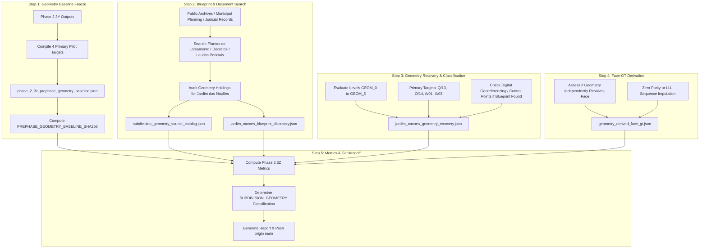

# Implementation Plan — Phase Address Finder 2.3Z
## Subdivision Blueprint & Parcel Geometry Recovery

## Problem Statement & Scientific Context

In **Phase Address Finder 2.3Y**, public documentary sources (Diário Oficial / DIOENET and Judicial Auction notices) proved capable of extracting **Level 2** cadastral attributes (`BC` $\leftrightarrow$ door number, lot identifier, subdivision block). However, because non-corner documentary records generally lack deed metes-and-bounds descriptions or corner confrontations, and under the mandatory methodological rule that **odd/even parity and lot contiguity cannot by themselves confer face assignment**, incremental independent Street-Face Ground Truth remained:
$$\text{INCREMENTAL\_USABLE\_FACE\_GT} = 0 / 6$$

The missing scientific link in the cadastral discovery program is therefore physical spatial geometry:
$$\text{SUBDIVISION BLOCK + LOT} \longrightarrow \text{PHYSICAL PARCEL POSITION} \longrightarrow \text{STREET FACE}$$

**Phase 2.3Z** investigates whether legitimate, open, public sources can recover **historical subdivision geometry** for Taubaté, focusing on the priority pilot neighborhood **Jardim das Nações** (where Phase 2.3Y already established verified bindings for Quadra Q / Lote 13, Quadra O / Lote 14, Quadra A / Lote 01, and Quadra X / Lote 03).

Per foundational scientific constraints, **no cadastral topology modeling or replication will be performed in this phase**. This phase is strictly dedicated to geometry acquisition.

---

## User Review Required

> [!IMPORTANT]
> **Operational Boundaries in Phase 2.3Z**:
> 1. **Zero Protected Portal Automation**: No automated querying of protected municipal portals, no CAPTCHA solving, no authenticated system bypass.
> 2. **Physical Geometry as Requirement**: Street name + lot number alone is NOT geometry. Acceptable evidence requires parcel polygons, lot boundary drawings, subdivision blueprints, block diagrams with numbered lots, explicit lot frontages, corner lot metes-and-bounds, coordinates, or independent ordered lot layouts.
> 3. **Prohibition of Cadastral Placement**: Strictly forbidden to place lots using `QQQ`/`LLL` numeric sequences, BC adjacency, or assumed door number progression.
> 4. **Separation of Concerns**: Any recovered geometry will be frozen; no re-run of Phase 2.3X3 will occur during Phase 2.3Z.

---

## Proposed Technical Strategy & Component Architecture

---

## Proposed Changes by Component

### Component 1: Pre-Phase Geometry Baseline Freeze
- Compile the frozen state for the primary pilot targets in Jardim das Nações:
  - `3.1.004.013` (Quadra Q, Lote 13, Rua Argentina)
  - `3.1.009.004` (Quadra O, Lote 14, Rua França)
  - `3.1.014.001` (Quadra A, Lote 01, Rua França)
  - `3.3.019.006` (Quadra X, Lote 03, Rua Síria)
- Record for each target: `BC`, `DSQLLL`, `SUBDIVISION_NAME`, `SUBDIVISION_BLOCK`, `LOT_ID`, `STREET`, `HOUSE_NUMBER`, `CURRENT_FACE_LEVEL` (`STREET_ONLY`), and `KNOWN_DOCUMENTS`.
- Compute and freeze `PREPHASE_GEOMETRY_BASELINE_SHA256` before initiating new searches.
- Output: [`facade-checker/data/address_finder_bc_anchors_v1/phase_2_3z_prephase_geometry_baseline.json`](file:///c:/Users/Marcel/.gemini/antigravity/playground/ultraviolet-quasar/facade-checker/data/address_finder_bc_anchors_v1/phase_2_3z_prephase_geometry_baseline.json).

---

### Component 2: Subdivision Blueprint & Geometry Search
- Investigate legitimate public sources capable of supplying parcel geometry:
  1. **Municipal Planning Archives & Decretos de Loteamento**:
     - Historical approval decrees and descriptive memorials of Jardim das Nações.
  2. **Judicial Appraisal Reports (Laudos Periciais de Avaliação TJSP)**:
     - Judicial dockets containing engineering inspection reports with lot boundary diagrams and registered deed confrontation transcripts.
  3. **SEPLAN / Open GIS Data Holdings**:
     - Municipal geoportals, SEPLAN vector repositories, and OpenStreetMap building/parcel vector overlays.
  4. **Registered Subdivision Blueprints (Plantas de Loteamento)**:
     - Historical cartographic surveys showing block layouts and numbered lot boundaries.
- Output:
  - [`subdivision_geometry_source_catalog.json`](file:///c:/Users/Marcel/.gemini/antigravity/playground/ultraviolet-quasar/facade-checker/data/address_finder_bc_anchors_v1/subdivision_geometry_source_catalog.json)
  - [`jardim_nacoes_blueprint_discovery.json`](file:///c:/Users/Marcel/.gemini/antigravity/playground/ultraviolet-quasar/facade-checker/data/address_finder_bc_anchors_v1/jardim_nacoes_blueprint_discovery.json)

---

### Component 3: Geometry Evidence Classification (GEOM_0 to GEOM_5)
Classify each pilot target under the standardized geometric hierarchy:
- **`GEOM_0`**: No geometry (textual record only).
- **`GEOM_1`**: Subdivision/block location only (general neighborhood/block identified).
- **`GEOM_2`**: Physical road block identified (mapped to specific OSM `PRB-XXXX`).
- **`GEOM_3`**: Lot ordering or lot diagram available (internal sequence of lots along the block documented).
- **`GEOM_4`**: Specific target lot identifiable on physical block (exact frontage/side established).
- **`GEOM_5`**: Target parcel polygon / explicit boundary geometry (metes-and-bounds coordinates or vector polygon).

For each target, record: `PRE_PHASE_GEOM_LEVEL`, `POST_PHASE_GEOM_LEVEL`, and `INCREMENTAL_GEOM_RECOVERY`.
- Output: [`facade-checker/data/address_finder_bc_anchors_v1/jardim_nacoes_geometry_recovery.json`](file:///c:/Users/Marcel/.gemini/antigravity/playground/ultraviolet-quasar/facade-checker/data/address_finder_bc_anchors_v1/jardim_nacoes_geometry_recovery.json).

---

### Component 4: Digital Georeferencing Protocol & Face-GT Derivation
- If an authentic subdivision blueprint is discovered:
  - Preserve the original image/PDF unchanged, compute its SHA-256 hash.
  - Georeference using permanent road centerline intersections (OSM graph). Strictly forbid using target BCs or QQQs as control points.
  - Document `CONTROL_POINT_COUNT`, `GEOREFERENCE_RMSE`, `TRANSFORMATION_TYPE`, and `SOURCE_MAP_HASH`.
- Derive Street-Face GT **strictly if and only if** independent geometry unambiguously resolves the physical street face.
- Separate `GEOMETRY_RECOVERED` from `FACE_DERIVED_FROM_GEOMETRY`.
- Output: [`facade-checker/data/address_finder_bc_anchors_v1/geometry_derived_face_gt.json`](file:///c:/Users/Marcel/.gemini/antigravity/playground/ultraviolet-quasar/facade-checker/data/address_finder_bc_anchors_v1/geometry_derived_face_gt.json).

---

### Component 5: Success Metrics & Final Synthesis
Compute global geometry recovery metrics:
- `SUBDIVISION_DOCUMENTS_REVIEWED`
- `BLUEPRINTS_FOUND`
- `BLUEPRINTS_WITH_LOT_NUMBERS`
- `PHYSICAL_BLOCKS_MAPPED`
- `TARGET_LOTS_GEOM_3_PLUS`
- `TARGET_LOTS_GEOM_4_PLUS`
- `TARGET_LOTS_GEOM_5`
- `NEW_FACE_GT_FROM_GEOMETRY`
- Primary Metric: `INCREMENTAL_TARGET_LOT_GEOMETRY_RECOVERY`

Classify the phase outcome:
- `SUBDIVISION_GEOMETRY_HIGH_VALUE`
- `SUBDIVISION_GEOMETRY_PARTIAL_VALUE`
- `SUBDIVISION_GEOMETRY_LOW_VALUE`
- `SUBDIVISION_GEOMETRY_INCONCLUSIVE`

Deliverables:
- [`phase_2_3z_metrics.json`](file:///c:/Users/Marcel/.gemini/antigravity/playground/ultraviolet-quasar/facade-checker/data/address_finder_bc_anchors_v1/phase_2_3z_metrics.json)
- [`brain/address_finder/reports/PHASE_2.3Z_SUBDIVISION_GEOMETRY_RECOVERY.md`](file:///c:/Users/Marcel/.gemini/antigravity/playground/ultraviolet-quasar/brain/address_finder/reports/PHASE_2.3Z_SUBDIVISION_GEOMETRY_RECOVERY.md)
- Update [`LATEST_PHASE_REPORT.md`](file:///c:/Users/Marcel/.gemini/antigravity/playground/ultraviolet-quasar/brain/address_finder/LATEST_PHASE_REPORT.md)
- Update [`LATEST_PHASE_RESULTS.json`](file:///c:/Users/Marcel/.gemini/antigravity/playground/ultraviolet-quasar/brain/address_finder/LATEST_PHASE_RESULTS.json)
- Commit and push to `origin main`.

---

## Verification Plan

### Automated Execution & Validation
- Run a standalone Python execution script `run_phase_2_3z_master.py` that executes all checks, builds the JSON deliverables, validates schemas, and computes SHA-256 hashes.
- Verify zero circular imputation: ensure no QQQ/LLL sequential numbering or parity was used to position lots.

### Manual / Structural Review
- Verify that every cited geometry source is authentic and traceable.
- Confirm that Phase 2.3X3 topology models are **not** re-run during this phase.
