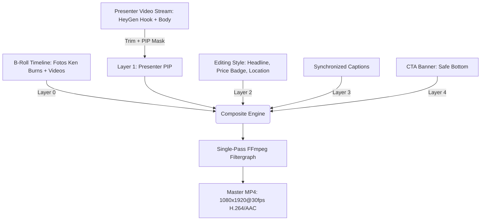
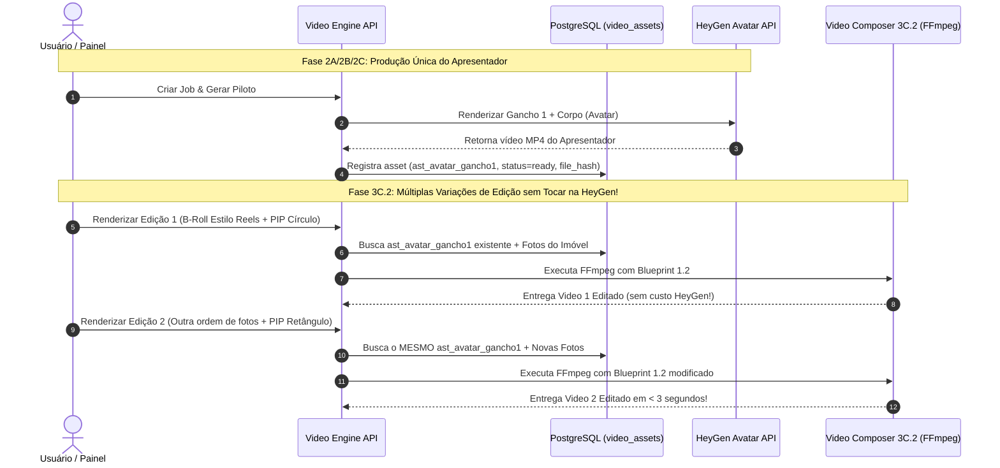

# Arquitetura e Plano de Implementação — Fase 3C.2
## B-Roll Dinâmico + Picture-in-Picture (PIP) no Video Composer Engine
### Video Engine V2 — Bali Imóveis

**Status:** Planejamento Arquitetural (PLAN ONLY — Aguardando Revisão Externa)  
**Data:** 05/09/2026  
**Repositório:** `mlapidotome/facade-checker` (`main`)  
**Commit Base Homologado (Fase 3C.1):** `f7934118fcee38072af598de83704b57273d6ccf`  
**Showcase Visual Homologado:** Job `c3c10000-0000-4000-8000-000000001639` (Ref CRM: `1639`)  
**Escopo:** Especificação técnica rigorosa, determinística e exaustiva da evolução do Video Composer para suporte a **B-Roll Multicamada de Imóveis (Fotos & Clipes de Vídeo)**, **Ken Burns Controlado**, **Picture-in-Picture (PIP) do Apresentador**, **Transições Determinísticas (Cut & Crossfade)**, **Evolução para Creative Blueprint 1.2 (`composer_v3`)**, **Preservação Byte-Safe dos Caminhos 1.0 e 1.1** e **Garantia de Não-Regeneração de Avatar/Voz ("Never Redo What Was Produced Correctly")**.

---

## 1. Contexto, Diagnóstico & Princípios Arquiteturais

### 1.1 Diagnóstico do Baseline Atual (Fase 3C.1)
Na Fase 3C.1, o Composer atingiu a capacidade de renderizar com precisão matemática:
- **Editing Styles versionáveis** com `style_hash` intrínseco;
- **Overlays dinâmicos em Safe Areas** (Headlines, Badges com Punch Zoom, Location Tags, CTA Banners);
- **Legendas sincronizadas** com fontes TrueType oficiais.

**O Gargalo Visual Identificado:**
O vídeo resultante ainda repousa sobre **uma única imagem estática do imóvel de fundo durante todo o desenvolvimento (30+ segundos)**, transmitindo uma sensação de vídeo estático com apresentador falando.

### 1.2 Objetivo da Fase 3C.2
Capacitar o Composer a construir uma **narrativa visual rica e dinâmica**, orquestrando múltiplos assets do imóvel ao longo do tempo:
- **Apresentador Fullscreen** na introdução/gancho (0.0s – 2.0s);
- **Cortes dinâmicos de B-roll** (Sala $\rightarrow$ Cozinha $\rightarrow$ Varanda Gourmet $\rightarrow$ Suíte Master);
- **Ken Burns suave e determinístico** para fotos de alta resolução;
- **Apresentador em Picture-in-Picture (PIP)** em momentos-chave sobre as imagens do imóvel;
- **Clipes de vídeo reais** do imóvel (filmagem vertical, tour ou drone) intercalados com a fala.

### 1.3 Separação Rígida de Responsabilidades

$$\begin{array}{ccc}
\boxed{\text{\bf Creative Intelligence (Fase Futura)}} & \xrightarrow{\text{decide O QUE e QUANDO exibir}} & \boxed{\text{\bf Creative Blueprint 1.2}} \\
\text{\small Análise semântica da copy, seleção de fotos,} & & \text{\small Contrato JSON puramente declarativo} \\
\text{\small marcação de momentos de PIP e B-roll} & & \text{\small com timelines, geometrias e trims} \\
& & \downarrow \\
& & \boxed{\text{\bf Video Composer 3C.2 (Esta Fase)}} \\
& & \text{\small Executor determinístico FFmpeg,} \\
& & \text{\small sem heurísticas, puro e auditável}
\end{array}$$

- **O Composer NÃO escolhe fotos, não adivinha qual ambiente é qual e não altera tempos:** Ele apenas executa deterministicamente o que o Blueprint 1.2 prescrever.
- **A Inteligência Criativa futura** encontrará no Composer 3C.2 uma API de montagem sólida, previsível e pronta para receber qualquer arranjo criativo.

---

## 2. Invariantes Arquiteturais Preservadas

1. **Retrocompatibilidade Estrita:**
   - Blueprints com `schema_version: "1.0"` continuam executando via caminho **`composer_v1`** (Fase 3B).
   - Blueprints com `schema_version: "1.1"` continuam executando via caminho **`composer_v2`** (Fase 3C.1).
   - Blueprints com `schema_version: "1.2"` executarão via novo caminho **`composer_v3`** (Fase 3C.2).
2. **Never Redo What Was Produced Correctly:**
   - Alterações em fotos, B-rolls, timings de corte ou posicionamento de PIP **NUNCA** disparam novas requisições à HeyGen ou nova síntese de áudio.
   - Os assets de avatar/áudio existentes no catálogo (`video_assets`) são reutilizados como inputs puros do Composer.
3. **Render Identity Determinística (`render_key`):**
   - Hashing canônico SHA-256 de todas as entradas que afetam pixels e áudio (Blueprint 1.2, `style_hash`, trims, geometrias de PIP, motions e `file_hash` de cada imagem e clipe físico).
4. **Claim Atômico Persistente no PostgreSQL:**
   - Nenhum processo FFmpeg é iniciado sem claim adquirido (`claimRenderLock`) com lease e stale recovery.
5. **Asset Identity Estrita:**
   - Proibido qualquer directory scanning ou fallback heurístico no filesystem. Todo asset deve ser resolvido via `asset_service` com validação de ownership e hash físico.
6. **Contrato de Saída Imutável & QC Físico:**
   - Saída atômica via `.tmp.<uuid>.mp4` e promoção por rename atômico após validação rigorosa por `ffprobe` (1080x1920@30fps, H.264/AAC, duração com tolerância máxima de 250ms).

---

## 3. Especificação do Contrato: Creative Blueprint 1.2

### 3.1 JSON Schema do Creative Blueprint 1.2

```json
{
  "$schema": "http://json-schema.org/draft-07/schema#",
  "title": "CreativeBlueprint_v1_2",
  "type": "object",
  "required": [
    "schema_version",
    "creative_id",
    "blueprint_version",
    "format",
    "editing_style",
    "audio_track",
    "visual_timeline"
  ],
  "properties": {
    "schema_version": { "type": "string", "enum": ["1.2"] },
    "creative_id": { "type": "string", "pattern": "^[a-zA-Z0-9_-]{1,64}$" },
    "blueprint_version": { "type": "integer", "minimum": 1 },
    "format": {
      "type": "object",
      "required": ["aspect_ratio", "width", "height", "fps"],
      "properties": {
        "aspect_ratio": { "type": "string", "enum": ["9:16"] },
        "width": { "type": "integer", "enum": [1080] },
        "height": { "type": "integer", "enum": [1920] },
        "fps": { "type": "integer", "enum": [30] }
      }
    },
    "editing_style": {
      "type": "object",
      "required": ["style_id", "version"],
      "properties": {
        "style_id": { "type": "string" },
        "version": { "type": "integer", "minimum": 1 }
      }
    },
    "audio_track": {
      "type": "object",
      "required": ["primary_asset_id"],
      "properties": {
        "primary_asset_id": { "type": "string" },
        "source_in_ms": { "type": ["integer", "null"], "minimum": 0 },
        "source_out_ms": { "type": ["integer", "null"], "minimum": 0 },
        "broll_audio_policy": { 
          "type": "string", 
          "enum": ["mute_all_broll", "duck_broll_background"],
          "default": "mute_all_broll" 
        }
      }
    },
    "visual_timeline": {
      "type": "array",
      "minItems": 1,
      "items": {
        "type": "object",
        "required": ["asset_id", "start_ms", "end_ms"],
        "properties": {
          "id": { "type": "string" },
          "asset_id": { "type": "string" },
          "role": { "type": "string" },
          "start_ms": { "type": "integer", "minimum": 0 },
          "end_ms": { "type": "integer", "minimum": 1 },
          "source_in_ms": { "type": ["integer", "null"], "minimum": 0 },
          "source_out_ms": { "type": ["integer", "null"], "minimum": 0 },
          "fit": { "type": "string", "enum": ["cover", "contain"], "default": "cover" },
          "motion": {
            "type": "object",
            "properties": {
              "type": { 
                "type": "string", 
                "enum": ["static", "ken_burns_zoom_in", "ken_burns_zoom_out", "pan_left", "pan_right"] 
              },
              "intensity": { "type": "number", "minimum": 1.0, "maximum": 1.25, "default": 1.10 }
            }
          },
          "transition_in": {
            "type": "object",
            "properties": {
              "type": { "type": "string", "enum": ["cut", "crossfade"] },
              "duration_ms": { "type": "integer", "minimum": 100, "maximum": 600, "default": 250 }
            }
          }
        }
      }
    },
    "pip": {
      "type": "object",
      "properties": {
        "enabled": { "type": "boolean" },
        "asset_id": { "type": "string" },
        "windows": {
          "type": "array",
          "items": {
            "type": "object",
            "required": ["start_ms", "end_ms", "position", "shape"],
            "properties": {
              "start_ms": { "type": "integer", "minimum": 0 },
              "end_ms": { "type": "integer", "minimum": 1 },
              "source_in_ms": { "type": ["integer", "null"], "minimum": 0 },
              "source_out_ms": { "type": ["integer", "null"], "minimum": 0 },
              "position": {
                "type": "string",
                "enum": ["bottom_right", "bottom_left", "center_right", "custom"]
              },
              "geometry": {
                "type": "object",
                "properties": {
                  "width": { "type": "integer", "default": 360 },
                  "height": { "type": "integer", "default": 540 },
                  "x": { "type": "integer" },
                  "y": { "type": "integer" }
                }
              },
              "shape": { 
                "type": "string", 
                "enum": ["rounded_rect", "circle", "rectangle"],
                "default": "rounded_rect"
              },
              "border": {
                "type": "object",
                "properties": {
                  "width": { "type": "integer", "default": 4 },
                  "color": { "type": "string", "default": "#FFFFFF" },
                  "radius": { "type": "integer", "default": 24 }
                }
              },
              "transition_in": {
                "type": "object",
                "properties": {
                  "type": { "type": "string", "enum": ["cut", "fade"] },
                  "duration_ms": { "type": "integer", "default": 200 }
                }
              },
              "transition_out": {
                "type": "object",
                "properties": {
                  "type": { "type": "string", "enum": ["cut", "fade"] },
                  "duration_ms": { "type": "integer", "default": 200 }
                }
              }
            }
          }
        }
      }
    },
    "overlays": { "type": "array" },
    "captions": { "type": "array" }
  }
}
```

### 3.2 Regras de Validação Fail-Fast do Blueprint 1.2
1. **Continuidade da `visual_timeline`:**
   - O primeiro clipe da timeline visual deve iniciar exatamente em `start_ms = 0`.
   - Para transições tipo `cut`, o `start_ms` do segmento $i+1$ deve ser igual ao `end_ms` do segmento $i$.
   - Para transições tipo `crossfade`, é permitida sobreposição exata igual a `duration_ms` da transição.
   - A timeline visual deve cobrir 100% da duração do áudio principal (tolerância $\le 250\text{ms}$).
2. **Consistência de Trims em Vídeos B-Roll:**
   - Se `source_in_ms` ou `source_out_ms` for fornecido, ambos são obrigatórios (trims bilaterais).
   - $\text{source\_out\_ms} - \text{source\_in\_ms} = \text{end\_ms} - \text{start\_ms}$.
3. **Validação de PIP vs Safe Areas e Overlays:**
   - A janela de PIP **não pode colidir** com a zona ativa de Overlays (ex: colisão com CTA inferior ou com Legendas).
   - O validador rejeita geometrias de PIP que invadam o retângulo de legendas ($y \in [1100, 1400]$ no centro) ou que excedam a largura de tela ($1080\text{px}$).

---

## 4. Arquitetura de B-Roll: Fotos com Ken Burns e Clipes de Vídeo

### 4.1 B-Roll de Fotos: Ken Burns Suave e Determinístico
Para transformar fotos estáticas em planos cinematográficos sem sensação de "imagem congelada":

1. **Aspect Ratio Conform:**
   - A imagem original é redimensionada proporcionalmente para cobrir a resolução $1080 \times 1920$ (`scale=1080*1.15:1920*1.15:force_original_aspect_ratio=increase,crop=...`).
2. **Expressão FFmpeg de Movimento Controlado:**
   - Em vez de filtros instáveis, o Ken Burns é compilado deterministicamente via `zoompan` ou expressões de `scale/crop`:
   - Exemplo (Zoom In suave de 1.0x para 1.10x ao longo de $N$ frames a 30fps):
     ```text
     zoompan=z='min(zoom+0.0015,1.10)':d=150:x='iw/2-(iw/zoom/2)':y='ih/2-(ih/zoom/2)':s=1080x1920:fps=30
     ```
   - Fator de escala contido ($1.00 \to 1.10$) para evitar perda de nitidez ou interpolações borradas.

### 4.2 B-Roll de Clipes de Vídeo Reais
1. **Trims e Normalização:**
   - O clipe B-roll tem seu trecho extraído com precisão de milissegundos (`trim=start=...:end=...`).
   - Normalização para $1080 \times 1920 @ 30\text{fps}$ com `setsar=1`.
2. **Política de Áudio dos Clipes:**
   - Por padrão (`mute_all_broll`), a trilha de áudio do clipe B-roll é descartada via `anullsrc` ou simplesmente não mapeada, preservando a clareza cristalina da voz do corretor/apresentador.

---

## 5. Arquitetura de Picture-in-Picture (PIP) do Apresentador

### 5.1 Geometria e Formas de PIP
O apresentador pode ser exibido sobreposto ao B-roll em momentos estratégicos:
1. **Formato Círculo (`circle`):** Diâmetro padrão de $360\text{px}$ com borda suave e máscara alpha circular.
2. **Formato Retângulo Arredondado (`rounded_rect`):** $360 \times 540\text{px}$ com raio de curvatura de $24\text{px}$ e borda contrastante.

### 5.2 Posicionamento e Safe Areas
Presets canônicos de posicionamento no `presets.js`:
- `bottom_right`: $x = 660, y = 1180$ (Posicionado acima da barra de CTA e à direita das legendas).
- `bottom_left`: $x = 60, y = 1180$.
- `center_right`: $x = 660, y = 700$.

### 5.3 Compilação FFmpeg do PIP
O vídeo do apresentador é processado em stream paralelo:
```text
[pip_in]trim=start=5.0:end=12.0,setpts=PTS-STARTPTS,
        scale=360:540:force_original_aspect_ratio=increase,crop=360:540,
        format=yuva420p,
        geq=lum='p(X,Y)':a='if(gt(sqrt(pow(X-180,2)+pow(Y-180,2)),180),0,255)'[pip_masked];
[broll_stream][pip_masked]overlay=x=660:y=1180:enable='between(t,5.0,12.0)':eof_action=pass[v_with_pip]
```

---

## 6. Z-Order / Pilha Canônica de Renderização

A composição do vídeo no FFmpeg segue uma ordem determinística de camadas:

$$\begin{array}{cll}
\text{\bf Layer} & \text{\bf Camada Visual} & \text{\bf Descrição Técnica} \\
\hline
\text{\bf L0} & \text{Background B-Roll Timeline} & \text{Fotos com Ken Burns + Clipes de vídeo + Transições (1080x1920)} \\
\text{\bf L1} & \text{Presenter PIP} & \text{Avatar em janela mascarada (círculo/retângulo) nos intervalos definidos} \\
\text{\bf L2} & \text{Editing Style Graphic Overlays} & \text{Headline Superior, Badge de Preço (Punch Zoom), Location Tag} \\
\text{\bf L3} & \text{Dynamic Captions} & \text{Legendas sincronizadas no centro/terço inferior} \\
\text{\bf L4} & \text{Conversion CTA Banner} & \text{Banner final de fechamento e chamada para ação}
\end{array}$$



---

## 7. Render Identity & `render_key` Canônica (`composer_v3`)

O hash determinístico `render_key` do Blueprint 1.2 incorpora:
1. `schema_version: "1.2"` e `composer_contract_version: "composer_v3"`;
2. `creative_id` e `blueprint_version`;
3. `format` canônico ($1080 \times 1920 @ 30\text{fps}$);
4. `editing_style` com `style_hash` físico;
5. `audio_track` canônico (com trims e política de áudio);
6. `visual_timeline` canônica (ordenada por `start_ms`, com trims, `fit`, `motion`, `transition`);
7. `pip` canônico (ordenado por `start_ms`, com geometrias, shapes e bordas);
8. `overlays` e `captions` canônicos sanitizados;
9. `input_assets`: Lista ordenada de todos os assets físicos participantes (áudio principal, avatar e todas as fotos/vídeos de B-roll), contendo `asset_id` e `file_hash` SHA-256 de cada arquivo físico.

$$\text{render\_key} = \text{SHA256}(\text{canonicalStringify}(\text{renderSpec12}))$$

**Invariante:** Se qualquer foto for alterada no disco, se um corte de B-roll mudar em 10ms, se o PIP mudar de posição ou se uma cor de overlay mudar, a `render_key` muda imediatamente, invalidando o cache e garantindo re-render fresco e correto.

---

## 8. Preservação da Regra: "Never Redo What Was Produced Correctly"

A arquitetura do Video Engine assegura o isolamento de custos e tempos de execução:



---

## 9. Plano de Homologação e Testes Automatizados (Fase 3C.2)

A suíte `tests/video_engine/phase3c2_composer_tests.js` validará:

1. **Validação de Contrato do Blueprint 1.2:**
   - Rejeição de sobreposições inválidas na timeline visual;
   - Rejeição de trims unilaterais em clipes B-roll;
   - Rejeição de colisões entre janela de PIP e zonas de Safe Area;
   - Aceitação estrita de blueprints válidos com e sem PIP.
2. **Determinismo de `render_key` (`composer_v3`):**
   - Hashing idempotente em execuções repetidas;
   - Alteração de hash ao mudar `motion`, `position` de PIP, timing ou foto física.
3. **Execução Física de FFmpeg com Multi-B-Roll:**
   - Renderização real de vídeo combinando 4 fotos reais com Ken Burns determinístico;
   - Extração de frames via `ffmpeg -ss` nos pontos de corte ($t_1, t_2, t_3, t_4$) e verificação de troca física de imagem via `pixelmatch`/estatísticas de cor.
4. **Execução Física de FFmpeg com Presenter PIP:**
   - Renderização real de clipe com avatar em janela circular sobreposta ao B-roll;
   - Verificação física da presença do apresentador no quadrante configurado e B-roll no fundo.
5. **Teste de Zero Regressão (Invariante Byte-Safe):**
   - Execução de Blueprint 1.0 gerando exatamente o output 3B;
   - Execução de Blueprint 1.1 gerando exatamente o output 3C.1;
   - Execução sem claim falhando estritamente antes do spawn de processo.

---

## 10. Checklist de Entregáveis da Fase 3C.2 (Para Execução Futura)

- [ ] `video_engine/styles/presets.js`: Adição de presets de PIP e motions de Ken Burns nos estilos oficiais.
- [ ] `video_engine/composer_service.js`: Implementação do caminho `composer_v3` (validação de Blueprint 1.2, compilação de timeline multicamada de B-roll e PIP no `filter_complex`).
- [ ] `video_engine/overlay_service.js`: Extensão para suporte a máscaras geométricas de PIP e composições compostas.
- [ ] `video_engine/api_v2.js`: Endpoint shadow `/api/v2/panel/video-jobs/:id/compose-shadow-3c2`.
- [ ] `tests/video_engine/phase3c2_composer_tests.js`: Suíte de homologação física cobrindo B-roll, Ken Burns, PIP e zero regressão.
- [ ] Interface Web do Painel (`video-painel.html`): Controles para preview de variações de B-roll e PIP.

---

**FIM DO DOCUMENTO DE PLANEJAMENTO DA FASE 3C.2**  
*Pronto para revisão externa e emissão de parecer para autorização de implementação.*
