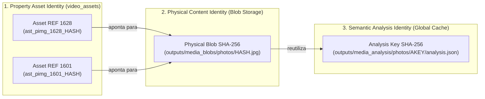
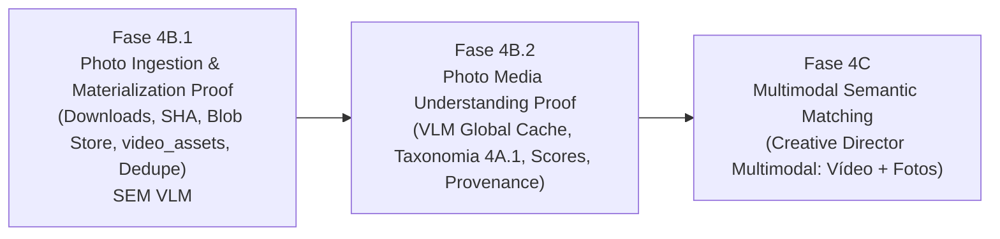

# Plano de Arquitetura: Photo Media Understanding (Fase 4B)
**Módulo:** Video Engine V2 — Bali Imóveis  
**Objetivo:** Ingestão física, deduplicação determinística, validação segura e análise semântica estruturada das fotos do CRM para integração multimodal com o Creative Director.  
**Invariante:** Zero Migrations (suporte nativo via `video_assets` com `asset_type = 'property_photo'`). Zero alteração em produção nesta rodada.

---

## 1. Diagnóstico Técnico Revisado (Estado Atual da Base)

| # | Pergunta Diagnóstica | Resposta Baseada no Código Real | Evidência / Arquivo no Código |
| :---: | :--- | :--- | :--- |
| **1** | *Como as fotos do CRM entram hoje no sistema?* | Entram via chamada `fetchImovelData(ref)` em `video_engine/job_service.js:46-93`. Na API ImobTotal (`GET /imoveis/:ref`), o payload retorna o array `imovel.fotos`. No fallback local (`data/banco_imoveis_carteira.json`), retorna `fotos: [{ url: foto_capa }]`. | [`video_engine/job_service.js#L54-L85`](file:///c:/Users/Marcel/.gemini/antigravity/playground/ultraviolet-quasar/video_engine/job_service.js#L54-L85) |
| **2** | *Onde ficam URLs `url` / `url_menor`?* | No payload do CRM, cada item do array `fotos` contém `url` (alta resolução), `url_menor` (thumbnail/miniatura), `categoria`, `destaque` e `posicao`. | [`video_engine/job_service.js#L58-L83`](file:///c:/Users/Marcel/.gemini/antigravity/playground/ultraviolet-quasar/video_engine/job_service.js#L58-L83) |
| **3** | *Elas já são materializadas localmente em algum ponto?* | **NÃO** no fluxo normal. O `getPropertyMediaPool` apenas mapeia os URLs do CRM em memória como pseudo-assets transitórios. Não há pasta física persistente `outputs/properties/<ref>/photos/`. | [`video_engine/property_media/property_media_service.js#L589-L601`](file:///c:/Users/Marcel/.gemini/antigravity/playground/ultraviolet-quasar/video_engine/property_media/property_media_service.js#L589-L601) |
| **4** | *Existem registros em `video_assets` para fotos?* | **NÃO** para fotos reais do imóvel no fluxo de ingestão. Registros de imagem só foram gerados em fixtures sintéticos de teste da Fase 3C.2 (`tests/fixtures/phase3c2/`). | [`tests/video_engine/phase3c2_composer_tests.js#L66-L87`](file:///c:/Users/Marcel/.gemini/antigravity/playground/ultraviolet-quasar/tests/video_engine/phase3c2_composer_tests.js#L66-L87) |
| **5** | *Existe asset_type apropriado para property photo?* | **SIM.** A migration 004 já define explicitamente no schema do PostgreSQL o tipo `'property_photo'` como um dos valores canônicos. | [`migrations/004_create_video_assets_and_blueprints.sql#L9`](file:///c:/Users/Marcel/.gemini/antigravity/playground/ultraviolet-quasar/migrations/004_create_video_assets_and_blueprints.sql#L9) |
| **6** | *Como o composer_v3 resolve fotos hoje?* | Resolve assets via `asset_service.resolveAndValidateAsset(assetId)`. Para `asset_type: 'image'`, ele valida o arquivo físico, extrai dimensões e compila o filtro FFmpeg com animação declarativa Ken Burns (`zoompan` streaming com corte exato para 1080x1920@30fps). | [`video_engine/composer_service.js#L428`](file:///c:/Users/Marcel/.gemini/antigravity/playground/ultraviolet-quasar/video_engine/composer_service.js#L428) e [`#L996-L1023`](file:///c:/Users/Marcel/.gemini/antigravity/playground/ultraviolet-quasar/video_engine/composer_service.js#L996-L1023) |
| **7** | *O Property Media Pool retorna fotos?* | **SIM, mas apenas como referências virtuais não-validadas.** Retorna `{ property_ref, photos: [...], videos: [...] }`, onde `photos` contém apenas URLs externos e IDs temporários `ast_crm_photo_${cleanRef}_${idx + 1}`. | [`video_engine/property_media/property_media_service.js#L593-L600`](file:///c:/Users/Marcel/.gemini/antigravity/playground/ultraviolet-quasar/video_engine/property_media/property_media_service.js#L593-L600) |
| **8** | *Qual é a identidade atual de uma foto?* | Atualmente é um placeholder posicional efêmero: `ast_crm_photo_${cleanRef}_${idx + 1}`. | [`video_engine/property_media/property_media_service.js#L594`](file:///c:/Users/Marcel/.gemini/antigravity/playground/ultraviolet-quasar/video_engine/property_media/property_media_service.js#L594) |
| **9** | *Existe SHA-256 físico das fotos?* | **NÃO** para as fotos do CRM, pois não são baixadas em staging nem materializadas. Apenas existe a função `assetService.computeFileHash(filePath)` pronta para ser aplicada aos bytes locais. | [`video_engine/asset_service.js#L107-L117`](file:///c:/Users/Marcel/.gemini/antigravity/playground/ultraviolet-quasar/video_engine/asset_service.js#L107-L117) |
| **10** | *Existe qualquer metadata/categoria útil fornecida pelo CRM?* | **SIM.** A API do ImobTotal fornece nos objetos de foto: `categoria` (ex: "Fachada", "Sala", "Cozinha"), `posicao` (ordem numérica), `destaque` (1 se foto principal) e `descricao`/`legenda`. | [`video_engine/job_service.js#L58-L85`](file:///c:/Users/Marcel/.gemini/antigravity/playground/ultraviolet-quasar/video_engine/job_service.js#L58-L85) |
| **11** | *O campo `categoria` das fotos possui valor real/utilizável?* | **Possui valor de proveniência/contexto secundário, mas NÃO é autoridade semântica.** Na prática de corretores, muitas fotos vêm marcadas como "Geral", "Outros", sem categoria ou erradas. Deve ser registrado como `crm_category` nos metadados, mas a autoridade semântica oficial deve vir do VLM. | Análise de domínio CRM e Taxonomia 4A.1 |
| **12** | *Existem duplicatas físicas entre fotos?* | **SIM.** Corretores frequentemente sobem a mesma foto duas vezes, sobem a versão original e o thumbnail recortado, ou enviam fotos idênticas de anúncios anteriores. A deduplicação por SHA-256 físico é mandatória. | Análise de integridade de dados |
| **13** | *Existem imagens muito pequenas/inválidas?* | **SIM.** CRMs frequentemente contêm logos da imobiliária cadastrados como foto (ex: 120x60), plantas baixas ilegíveis, banners de "Vendido" ou links quebrados (404/0 bytes). | Análise de robustez de mídia |
| **14** | *Como o sistema atualmente valida decode/dimensão?* | O sistema possui utilitários de `ffprobe` (`execFile('ffprobe', ...)`) que inspecionam qualquer container de imagem (JPEG, PNG, WebP) retornando `width`, `height`, `codec_name`, `size`. | [`video_engine/composer_service.js#L1517-L1533`](file:///c:/Users/Marcel/.gemini/antigravity/playground/ultraviolet-quasar/video_engine/composer_service.js#L1517-L1533) |
| **15** | *Precisamos estender Asset Model ou já existe estrutura suficiente?* | **ESTRUTURA EXISTENTE É 100% SUFICIENTE! ZERO MIGRATIONS!** A tabela `video_assets` já possui todas as colunas necessárias (`property_ref`, `asset_type = 'property_photo'`, `storage_path`, `remote_url`, `file_hash`, `generation_key`, `specs JSONB`, `metadata JSONB`, `status`). | [`migrations/004_create_video_assets_and_blueprints.sql#L5-L22`](file:///c:/Users/Marcel/.gemini/antigravity/playground/ultraviolet-quasar/migrations/004_create_video_assets_and_blueprints.sql#L5-L22) |

---

## 2. Separação de Identidades (Asset vs Conteúdo vs Análise)

Para evitar conflitos de ownership entre imóveis que compartilham a mesma foto física, definimos formalmente 3 camadas de identidade estritamente desacopladas:



### 2.1 As Três Identidades Canônicas

1. **Property Asset Identity (`asset_id` em `video_assets`):**
   - Escopo: **Específico da Propriedade**.
   - Garante que a REF 1628 e a REF 1601 tenham registros próprios no banco, cada uma com seus metadados, status e integridade.
   - Fórmula:
     $$\text{asset\_id} = \text{"ast\_pimg\_"} + \text{SHA-256}(\text{property\_ref} + \text{":"} + \text{physical\_file\_hash})[0..32]$$
2. **Physical Content Identity (`physical_file_hash`):**
   - Escopo: **Global / Agnóstico de Propriedade**.
   - Representa os bytes reais do arquivo baixado e validado.
   - Fórmula: SHA-256 puro em streaming sobre os bytes exatos do arquivo de imagem decodificado.
3. **Semantic Analysis Identity (`photo_analysis_key`):**
   - Escopo: **Global / Agnóstico de Propriedade**.
   - Representa o entendimento semântico dos bytes sob uma versão específica de modelo e prompt.
   - Fórmula:
     $$\text{photo\_analysis\_key} = \text{SHA-256}\left(\text{canonicalJSON}\left(\begin{array}{l}
     \text{physical\_file\_hash}, \\
     \text{analyzer\_type}, \\
     \text{analyzer\_version}, \\
     \text{model\_id}, \\
     \text{prompt\_version}, \\
     \text{schema\_version}, \\
     \text{analysis\_config}
     \end{array}\right)\right)$$

---

## 3. Decisão Arquitetural: Content-Addressed Blob Store vs Property Directory

### Comparativo Técnico

| Critério | Opção A: Property-Scoped File (`outputs/properties/<ref>/photos/...`) | Opção B: Content-Addressed Blob Store (`outputs/media_blobs/photos/<hash>.<ext>`) |
| :--- | :--- | :--- |
| **Deduplicação Cross-Property** | Duplica bytes no disco se dois imóveis usarem a mesma foto. | **Zero duplicação no disco:** 1 arquivo físico serve N propriedades. |
| **Concorrência e Races** | Risco de conflito se múltiplos workers limparem pastas da propriedade. | **Imutabilidade absoluta:** Se o blob `<hash>.jpg` já existe com o hash correto, é reutilizado sem novo write. |
| **Cache Semântico** | Exige buscar análises em pastas de outras propriedades. | **Direto e Natural:** O blob aponta deterministicamente para a pasta global de análise. |
| **Path Containment** | Requer validação de containment por propriedade. | Validação simples de containment sob `outputs/media_blobs/photos/`. |

### Decisão Arquitetural
**Adotamos a Opção B (Content-Addressed Immutable Blob Store)** com link/referência em `video_assets`:
- O arquivo físico canônico é publicado uma única vez em:
  `outputs/media_blobs/photos/<physical_file_hash>.<ext>`
- O registro em `video_assets` da propriedade (`property_ref = '1628'`) armazena `storage_path = 'outputs/media_blobs/photos/<physical_file_hash>.<ext>'` e `file_hash = physical_file_hash`.
- Caso seja desejável navegação local por imóvel, um hard link ou visualizador em `outputs/properties/<ref>/photos/` pode ser criado sem duplicar armazenamento físico.

---

## 4. Concorrência e Filesystem Publication Seguro

Para eliminar classes de race condition e garantir que workers de ingestão **nunca** interfiram em arquivos compartilhados:

1. **Staging Exclusivo por Processo/Worker:**
   - Todo download é feito em um diretório temporário isolado:
     `outputs/media_blobs/photos/.tmp/ingest_<token>_<uuid>.tmp`
2. **Validação Pré-Publicação:**
   - Inspeção de integridade física via FFprobe e Decode real antes de mover para o path final.
   - Cálculo do `physical_file_hash` ($H$).
3. **Regras Estritas de Publicação e Bloqueio de Unlink de Blobs Canônicos:**
   - Caminho final canônico: `canonicalPath = outputs/media_blobs/photos/<H>.<normalized_ext>`
   - **Caso 1 — `canonicalPath` não existe:**
     - Worker promove seu staging de forma segura via `fs.renameSync(staging, canonicalPath)`.
     - Valida a publicação e prossegue com a criação do property asset.
   - **Caso 2 — `canonicalPath` já existe:**
     - Worker calcula o SHA-256 físico do arquivo existente (`existingHash`).
     - **Se `existingHash === H`:**
       - **CACHE / DEDUPLICATION HIT:** O worker descarta **apenas** seu arquivo de staging temporário (`.tmp`) e reutiliza o `canonicalPath` já existente.
     - **Se `existingHash !== H`:**
       - **FAIL FAST:** Lança erro imediato `CANONICAL_BLOB_INTEGRITY_ERROR`.
       - O worker **NUNCA** executa `unlink` sobre o `canonicalPath`, **NUNCA** sobrescreve o `canonicalPath`, e **NUNCA** tenta repair automático in-band. O blob global compartilhado é preservado intacto e a divergência é registrada para investigação out-of-band.
4. **Concorrência de Primeira Publicação (Races entre Workers):**
   - Se Worker A e Worker B baixam simultaneamente a mesma foto ($H$) quando o blob canônico ainda não existe:
     - Ambos produzem exatamente os mesmos bytes e hash $H$.
     - Um dos workers concluirá o `renameSync` primeiro.
     - O segundo worker detecta a existência de `canonicalPath`, valida que `existingHash === H`, descarta seu staging temporário no `.tmp`, e ambos vinculam seus respectivos property assets ao mesmo blob canônico válido.
5. **Regra de Ouro de Cleanup:**
   - O worker de ingestão **NUNCA** executa `unlink` ou qualquer operação destrutiva sobre o diretório `outputs/media_blobs/photos/` principal ou sobre qualquer arquivo canônico publicado; o cleanup de erro é estritamente restrito ao seu próprio arquivo de staging temporário (`.tmp`).

---

## 5. Proteção de Rede e SSRF / Redirect Policy

A camada de download implementa segurança em profundidade:

1. **Whitelist Dinâmica Baseada em Domínios do CRM:**
   - Permitidos apenas hosts homologados extraídos dos metadados oficiais do CRM:
     `app.imobtotal.com.br`, `cdn.sobressai.com.br`, `img.imobtotal.com.br`, `storage.googleapis.com`, `s3.amazonaws.com`.
2. **Hop-by-Hop Redirect Validation:**
   - O downloader não segue redirects cegamente (`maxRedirects: 0` manual ou interceptor com validação de URL a cada salto).
   - Cada URL de redirect passa pela validação de whitelist de domínio e protocolo (`https:` ou `http:` homologado).
3. **Bloqueio de IP Privado e Loopback (DNS Resolution Filter):**
   - Resolução DNS prévia para validar o IP de destino.
   - Bloqueio de `127.0.0.0/8`, `10.0.0.0/8`, `172.16.0.0/12`, `192.168.0.0/16`, `169.254.0.0/16` (Cloud Metadata AWS/GCP `169.254.169.254`), e esquemas `file://`, `ftp://`, `gopher://`.
4. **Limites Físicos de Download:**
   - Timeout estrito: `PHOTO_DOWNLOAD_TIMEOUT_MS = 15000` (15s).
   - Tamanho máximo de payload: `PHOTO_MAX_SIZE_MB = 25` (25 MB). Abort imediato via streaming se o Content-Length ou bytes recebidos excederem o limite.

---

## 6. Validação Física: FFprobe + Decode Real

Para garantir que o arquivo não é apenas um cabeçalho JPEG válido com dados corrompidos ou um payload disfarçado (polyglot):

1. **Etapa 1: Inspeção Estrutural com FFprobe:**
   ```bash
   ffprobe -v error -show_entries stream=codec_name,width,height,pix_fmt -show_entries format=format_name,size -of json <filePath>
   ```
   - Valida codec de imagem (`mjpeg`, `png`, `webp`).
   - Extrai dimensões físicas `width` e `height`.
2. **Etapa 2: Validação de Decodificação Real (Full Decode Check):**
   ```bash
   ffmpeg -v error -i <filePath> -f null -
   ```
   - Se o comando retornar código de saída `0`, a imagem é 100% decodificável em pixels reais.
   - Se retornar erro (ex: *corrupt JPEG data*, *premature EOF*, *invalid SOS marker*), o arquivo é imediatamente rejeitado como `CORRUPTED_IMAGE` e não entra no catálogo.

---

## 7. Política de Resolução Mínima e Aspect Ratio (Configurável)

Em vez de congelar um valor arbitrário como invariante imutável, a política de admissão de imagem é parametrizada e auditável:

- **`PHOTO_MIN_SHORT_EDGE_PX` (Default: `480px`, configurável via env):**
  $\min(\text{width}, \text{height}) \ge \text{PHOTO\_MIN\_SHORT\_EDGE\_PX}$
- **`PHOTO_MAX_ASPECT_RATIO` (Default: `3.0`, configurável via env):**
  $1/3.0 \le (\text{width} / \text{height}) \le 3.0$ (rejeita banners horizontais ou tiras decorativas ilegíveis).
- **Relatório de Diagnóstico no Showcase 4B.1:**
  A execução na REF 1628 reportará a distribuição de resolução de todas as fotos do anúncio, listando quantas foram aceitas e quantas caíram nos thresholds para calibração empírica.

---

## 8. Proveniência e Modelo de Metadados do CRM

Para fotos duplicadas dentro do mesmo imóvel ou entre imóveis, nenhuma informação de negócio é perdida:

```json
{
  "asset_id": "ast_pimg_1628_8a12fbc33984",
  "property_ref": "1628",
  "asset_type": "property_photo",
  "physical_file_hash": "8a12fbc33984e49195b0...",
  "storage_path": "outputs/media_blobs/photos/8a12fbc33984e49195b0....jpg",
  "specs": {
    "width": 1920,
    "height": 1080,
    "format": "jpeg",
    "aspect_ratio": "16:9",
    "file_size_bytes": 482104
  },
  "metadata": {
    "source_references": [
      {
        "crm_photo_id": "crm_ph_1628_01",
        "url": "https://cdn.sobressai.com.br/fotos/1628/foto1.jpg",
        "url_menor": "https://cdn.sobressai.com.br/fotos/1628/foto1_thumb.jpg",
        "crm_category_raw": "Cozinha",
        "crm_position": 1,
        "crm_is_cover": true
      },
      {
        "crm_photo_id": "crm_ph_1628_09",
        "url": "https://cdn.sobressai.com.br/fotos/1628/foto9_duplicate.jpg",
        "crm_category_raw": "Área de Serviço",
        "crm_position": 9,
        "crm_is_cover": false
      }
    ]
  }
}
```

---

## 9. Análise Semântica e Qualidade Técnica (Desacoplamento Físico vs IA)

### 9.1 Métricas Determinísticas (Computadas Localmente, Sem IA)
- `specs.width`, `specs.height`, `specs.aspect_ratio`
- `specs.orientation`: `'landscape'` | `'portrait'` | `'square'`
- `specs.file_size_bytes`
- `specs.format`: `'jpeg'` | `'png'` | `'webp'`

### 9.2 Métricas Semânticas (Avaliadas pelo VLM)
- `room_type` (taxonomia unificada de 16 cômodos da 4A.1)
- `features` (taxonomia unificada de 17 características da 4A.1)
- `shot_type`: `'wide'` | `'medium'` | `'detail'`
- `technical_quality_score` $[0.0, 1.0]$: nitidez visual, ausência de blur, exposição balanceada.
- `aesthetic_score` $[0.0, 1.0]$: amplitude, beleza do enquadramento, apelo comercial.
- `confidence` $[0.0, 1.0]$: grau de certeza da classificação.
- `description`: resumo textual em 1 frase.

### 9.3 Reconciliation de Categoria (CRM vs VLM)
- `crm_semantic_hint`: categoria original declarada no CRM (ex: "Cozinha").
- `vlm_prediction`: `room_type` identificado pelo VLM (ex: `kitchen`).
- `divergence_detected`: `boolean` (registrado se houver divergência semântica para auditoria do Creative Director).

---

## 10. Fases Sequenciais de Execução



### Fase 4B.1 — Photo Ingestion & Materialization Proof (Próxima Fase)
- **Objetivo:** Materializar e catalogar as fotos reais da **REF 1628** sem chamadas de IA.
- **Entregáveis:**
  - Downloader seguro com proteção SSRF e whitelist de domínios.
  - Validação via FFprobe e Decode real.
  - Blob store content-addressed em `outputs/media_blobs/photos/`.
  - Deduplicação exata por SHA-256 físico.
  - Registro property-scoped em `video_assets` (`asset_type = 'property_photo'`).
  - Relatório diagnóstico de fotos da REF 1628 (resoluções, duplicatas, formatos).

### Fase 4B.2 — Photo Media Understanding Proof
- **Objetivo:** Analisar semanticamente as fotos físicas únicas materializadas na 4B.1.
- **Entregáveis:**
  - `PhotoMediaUnderstandingService` com cache global em `outputs/media_analysis/photos/<analysis_key>/`.
  - Extração de `room_type`, `features`, `shot_type`, `orientation` e scores.
  - Tabela comparativa humana de acurácia da REF 1628.

### Fase 4C — Multimodal Semantic Matching (Creative Director 4C)
- **Objetivo:** Permitir ao Creative Director avaliar conjuntamente takes de vídeo e fotos estáticas com Ken Burns motion, escolhendo a mídia de maior score semântico e qualidade para cada beat do roteiro.

---

## 11. Matriz de Testes Formais Prevista (Fase 4B)

A suíte formal de testes da Fase 4B cobrirá os seguintes cenários:

- **Cenário A:** Download e materialização de foto válida do CRM com status `ready`.
- **Cenário B:** Cálculo streaming determinístico de `physical_file_hash`.
- **Cenário C:** Rejeição de URL fora da whitelist de domínios autorizados.
- **Cenário D:** Tentativa de SSRF / IP privado / loopback bloqueada com erro explícito.
- **Cenário E:** Redirect para host não-autorizado ou IP privado bloqueado hop-by-hop.
- **Cenário F:** Arquivo corrompido / truncado rejeitado pelo full decode check.
- **Cenário G:** Imagem com dimensão inferior a `PHOTO_MIN_SHORT_EDGE_PX` rejeitada por limite.
- **Cenário H:** Imagem com aspect ratio extremo ($> 3.0$ ou $< 0.33$) rejeitada.
- **Cenário I:** Deduplicação exata na mesma propriedade reutiliza o mesmo asset físico preservando provenances.
- **Cenário J:** Publicação atômica em staging `.tmp` sem colisão ou path traversal.
- **Cenário K:** Determinação determinística de `orientation` (`landscape`, `portrait`, `square`).
- **Cenário L:** Atualização de `getPropertyMediaPool` expondo fotos validadas com `file_hash` e `specs`.
- **Cenário M:** Invariante de imutabilidade: asset `ready` não é sobrescrito com bytes divergentes.
- **Cenário W:** Mesmos bytes em duas propriedades geram `asset_id`s distintos sem colisão de ownership.
- **Cenário X:** Mesmos bytes em duas propriedades reutilizam o mesmo `photo_analysis_key` do cache global.
- **Cenário Y:** Múltiplas referências de foto no CRM com mesmo conteúdo preservam array completo de metadados.
- **Cenário Z:** Ingestão concorrente da mesma foto por dois workers nunca permite ao loser apagar o arquivo do winner.
- **Cenário AA:** Arquivo canônico existente no blob store com hash correto é reutilizado sem novo download.
- **Cenário AB:** Imagem truncada com dados corrompidos descartada em staging antes de afetar o catálogo.
- **Cenário AC:** Tentativa de redirect para IP de metadata em nuvem (`169.254.169.254`) bloqueada imediatamente.
- **Cenário AD:** Falha de decode real impede que o asset transite para o status `ready`.
- **Cenário AE:** Mudança de URL com bytes idênticos não invalida o cache semântico global.
- **Cenário AF:** Mudança de bytes sob a mesma URL gera nova identidade física e novo asset.
- **Cenário AG:** Limiar de resolução `PHOTO_MIN_SHORT_EDGE_PX` é estritamente configurável via env.
- **Cenário AH:** Validação de `room_type` contra a taxonomia unificada de 16 cômodos (Fase 4B.2).
- **Cenário AI:** Validação de `features` contra a taxonomia unificada de 17 features (Fase 4B.2).
- **Cenário AJ:** Divergência entre `crm_category` e `vlm_prediction` registrada sem perda da proveniência original.
- **Cenário AK:** Composer V3 e Property Video Ingestion permanecem 100% desacoplados e intocados.
- **Cenário AL:** Canonical blob inexistente $\rightarrow$ publicação bem-sucedida no blob store global.
- **Cenário AM:** Canonical blob já existe com hash correto $\rightarrow$ reutilização sem rewrite (idempotência segura).
- **Cenário AN:** Canonical blob existe com hash divergente do nome esperado $\rightarrow$ FAIL FAST (`CANONICAL_BLOB_INTEGRITY_ERROR`) e o arquivo canônico **NÃO** é removido ou modificado.
- **Cenário AO:** Dois workers publicando simultaneamente os mesmos bytes $\rightarrow$ um único blob canônico válido permanece.
- **Cenário AP:** Worker loser em concorrência remove **somente** seu arquivo de staging próprio no `.tmp`.
- **Cenário AQ:** Nenhum caminho normal de erro executa `unlink` no blob global.
- **Cenário AR:** Dois property assets de refs diferentes (`1628` e `1601`) apontam para o mesmo blob físico sem conflito de ownership.

---

## 12. Preservação de Invariantes

- **Zero Alteração em Código de Produção:** Nenhum arquivo em `video_engine/` ou `tests/` foi alterado.
- **Zero Migrations:** Nenhuma migration foi criada ou executada.
- **Zero Chamada de API:** Nenhuma chamada externa a provedores de IA ou download em produção foi executada.
- **Showcase 4A.3 Intocado:** O vídeo `outputs/jobs/job_showcase_pvid_1628_semantic_v2/showcase_4a3_semantic_matching.mp4` e seus artefatos permanecem imutáveis.
