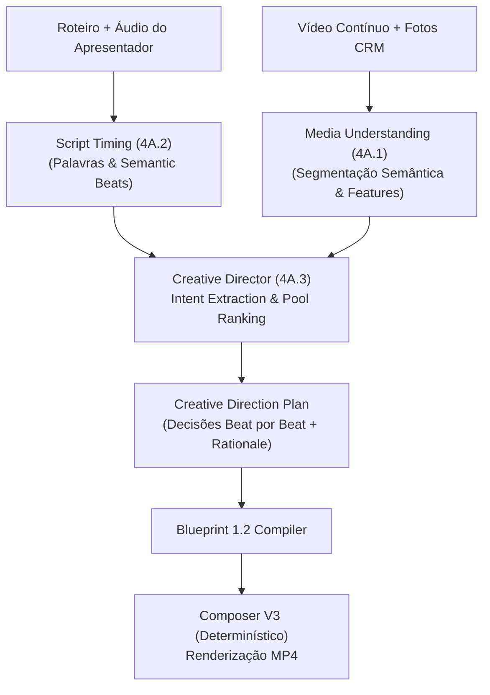

# Arquitetura e Plano de Implementação — Fase 4A.3: Semantic Matching & Creative Director Showcase
**Video Engine V2 — Bali Imóveis**
**Status**: Planejamento Técnico Submetido para Homologação Externa
**Versão**: 1.0.0 (Fase 4A.3)

---

## 1. Visão Geral e Objetivo Central

A Fase 4A.3 conecta duas inteligências autônomas já homologadas:
1. **Media Understanding (Fase 4A.1)**: compreensão semântica temporal das mídias reais do imóvel (segmentos contíguos de cômodos, features visuais, scores de qualidade técnica e estética).
2. **Script Timing (Fase 4A.2)**: alinhamento forçado determinístico com timestamps milimétricos de palavras e semantic beats a partir do áudio real do apresentador.

O **Creative Director** da Fase 4A.3 é o motor de decisão editorial responsável por responder:
> *"Dado o que está sendo falado neste exato instante do roteiro e o acervo visual real disponível, qual é o melhor take para exibir na tela e por qual motivo editorial?"*



---

## 2. Contratos e Schemas Formais

### 2.1 Schema do `creative_direction_plan`
Persistido de forma imutável em:
`outputs/jobs/<job_id>/creative_direction/<creative_direction_key>/direction_plan.json`

```json
{
  "schema_version": "1.0.0",
  "creative_direction_key": "SHA256_HEX_64",
  "job_id": "job_showcase_pvid_1628_...",
  "property_ref": "1628",
  "script_timing_key": "SHA256_HEX_64",
  "beat_analysis_key": "SHA256_HEX_64",
  "media_understanding_key": "SHA256_HEX_64",
  "director_version": "1.0.0",
  "scoring_weights": {
    "semantic_relevance": 0.50,
    "technical_quality": 0.30,
    "aesthetic_score": 0.20
  },
  "editorial_rules_version": "1.0.0",
  "beats_count": 4,
  "decisions": [
    {
      "beat_index": 0,
      "start_ms": 0,
      "end_ms": 3820,
      "duration_ms": 3820,
      "spoken_text": "Venha se encantar com esta cozinha moderna repleta de armários planejados.",
      "semantic_intent": {
        "requested_room_types": ["kitchen"],
        "requested_features": ["planned_cabinets", "modern_fixtures"],
        "visual_cues": ["kitchen", "cozinha", "armarios", "planejados"]
      },
      "candidates": [
        {
          "candidate_id": "seg_kitchen_01",
          "asset_id": "ast_pvid_1628_video",
          "media_type": "property_video_segment",
          "room_type": "kitchen",
          "features": ["porcelain_tile", "modern_fixtures", "planned_cabinets"],
          "available_start_ms": 1800,
          "available_end_ms": 7800,
          "semantic_relevance": 1.00,
          "technical_quality": 0.78,
          "aesthetic_score": 0.68,
          "repetition_penalty": 0.00,
          "duration_penalty": 0.00,
          "final_match_score": 0.87,
          "selection_reason": "Match perfeito de cômodo (kitchen) e features (planned_cabinets, modern_fixtures)"
        }
      ],
      "selected_candidate_id": "seg_kitchen_01",
      "selected_asset_id": "ast_pvid_1628_video",
      "media_type": "property_video_segment",
      "source_in_ms": 1800,
      "source_out_ms": 5620,
      "confidence": 0.95,
      "fallback_used": false,
      "selection_reason": "Vencedor por maior relevância semântica (cozinha com planejados) e qualidade estável"
    }
  ],
  "created_at": "2026-09-05T21:55:00.000Z"
}
```

---

## 3. Algoritmo de Semantic Matching & Ranking Reproduzível

### 3.1 Extração da Intenção Semântica do Beat (`semantic_intent`)
1. **Room Types Requisitados**:
   - Mapeamento direto de termos textuais e lemas fonéticos (`sala` $\rightarrow$ `living_room`, `cozinha` $\rightarrow$ `kitchen`, `varanda/sacada` $\rightarrow$ `balcony`, `quarto/dormitório/suíte` $\rightarrow$ `bedroom`/`suite`, `vista` $\rightarrow$ `city_view`).
2. **Features Requisitadas**:
   - Pistas visuais normalizadas (`armários planejados` $\rightarrow$ `planned_cabinets`, `iluminada/sol` $\rightarrow$ `natural_lighting`, `piso madeira` $\rightarrow$ `wooden_floor`, `vista` $\rightarrow$ `city_view`, `churrasqueira` $\rightarrow$ `barbecue_grill`).

### 3.2 Cálculo da Relevância Semântica (`semantic_relevance`)
A relevância semântica é o filtro primário absoluto. Qualidade estética **jamais** compensa um cômodo incorreto.

- **Match Exato de Cômodo** (`room_type == requested_room_type`):
  $$\text{base} = 0.80$$
- **Match de Features Adicionais**:
  $$+ 0.10 \text{ por feature coincidente (limitado a } +0.20\text{)}$$
  $$\text{semantic\_relevance} = \min(1.0, 0.80 + \text{feature\_bonus})$$
- **Cômodo Relacionado / Compatível** (ex: `dining_room` quando pedido `living_room`, ou `city_view` quando pedido `balcony`):
  $$\text{base} = 0.50 + \text{feature\_bonus}$$
- **Cômodo Incompatível** (ex: `bathroom` quando pedido `kitchen`):
  $$\text{semantic\_relevance} = 0.00$$

### 3.3 Fórmula de Pontuação Final (`final_match_score`)
$$\text{final\_match\_score} = (\text{semantic\_relevance} \times 0.50) + (\text{technical\_quality} \times 0.30) + (\text{aesthetic\_score} \times 0.20) - \text{penalties}$$

#### Penalidades Editoriais Determinísticas:
1. **Penalidade de Repetição Consecutiva (`repetition_penalty = 0.25`)**:
   - Aplicada se o mesmo asset/segmento foi selecionado no beat imediatamente anterior, a menos que o beat atual seja continuação direta do mesmo tema.
2. **Penalidade de Duração Insuficiente (`duration_penalty = 0.30`)**:
   - Se o segmento de vídeo tiver duração restante menor que o tempo necessário para o beat ($< \text{duration\_ms}$).

---

## 4. Continuidade Editorial e Regras Anti-Microcorte

1. **Duração Mínima Visual**:
   - Nenhum take pode durar menos de $1500\text{ ms}$ (evita cortes estroboscópicos).
2. **Fusão de Beats Contíguos de Mesmo Tema (Take Extension)**:
   - Se o Beat $N$ e Beat $N+1$ tratam do mesmo cômodo/assunto e o segmento de vídeo possui duração suficiente, o Creative Director mantém o mesmo take contínuo estendendo `source_out_ms`, em vez de introduzir um corte brusco artificial.
3. **Respeito aos Limites do Áudio**:
   - Todo corte no Blueprint coincide perfeitamente com os timestamps de início e fim dos beats de áudio do apresentador.

---

## 5. Política de Fallback Determinístico

Quando nenhum candidato do pool atingir `semantic_relevance >= 0.40` (por exemplo, falas genéricas de fechamento como *"Não perca essa oportunidade e agende hoje mesmo!"*):
1. O sistema define explicitamente `fallback_used = true`.
2. Registra o `selection_reason = "Fallback ativado: fala sem referência direta a cômodo específico"`.
3. Seleciona a melhor mídia de alta qualidade estética geral do imóvel (fachada, sala de estar ampla, ou modo apresentador full-screen / PIP) ordenada por `aesthetic_score * 0.60 + technical_quality * 0.40`.

---

## 6. Fingerprint Canônico e Cache Imutável

O hash identificador `creative_direction_key` garante reprodutibilidade matemática estrita:

```javascript
const canonicalObj = {
  script_timing_key: scriptTimingKey.trim().toLowerCase(),
  beat_analysis_key: beatAnalysisKey.trim().toLowerCase(),
  media_understanding_key: mediaUnderstandingKey.trim().toLowerCase(),
  director_version: directorVersion.trim(),
  scoring_weights: canonicalizeValue(scoringWeights),
  editorial_rules_version: editorialRulesVersion.trim(),
  schema_version: SCHEMA_VERSION
};

const canonicalJSON = canonicalStringify(canonicalObj);
const creativeDirectionKey = crypto.createHash('sha256').update(canonicalJSON, 'utf8').digest('hex');
```

---

## 7. Estratégia de Showcase Real para REF 1628

### 7.1 Mídias Comprovadamente Existentes na REF 1628 (Fase 4A.1)
- **Segmento 1**: `kitchen` (1.8s a 7.8s, duração 6.0s) — *porcelain_tile, modern_fixtures, planned_cabinets*
- **Segmento 4**: `balcony` / `city_view` (11.4s a 15.0s, duração 3.6s) — *city_view*
- **Segmento 5**: `living_room` (15.0s a 21.0s, duração 6.0s) — *furnished, bright, spacious, natural_lighting*
- **Segmento 8 & 15**: `bedroom` (23.4s a 28.2s & 40.2s a 50.8s) — *wooden_floor, natural_lighting, planned_cabinets*

### 7.2 Roteiro Imobiliário Oficial de Prova da Fase 4A.3
> *"Venha se encantar com esta cozinha moderna repleta de armários planejados. A varanda ampla oferece uma vista espetacular da cidade. A sala de estar é iluminada e perfeita para receber, com dormitórios aconchegantes com piso em madeira."*

### 7.3 Mapeamento Editorial Esperado (Gabarito de Verificação Visual):
1. **Beat 1** ("Cozinha moderna repleta de armários planejados") $\rightarrow$ **Segmento 1 (`kitchen`)**
2. **Beat 2** ("Varanda ampla oferece uma vista espetacular da cidade") $\rightarrow$ **Segmento 4 (`balcony/city_view`)**
3. **Beat 3** ("Sala de estar é iluminada e perfeita para receber") $\rightarrow$ **Segmento 5 (`living_room`)**
4. **Beat 4** ("Dormitórios aconchegantes com piso em madeira") $\rightarrow$ **Segmento 8/15 (`bedroom`)**

---

## 8. Arquivos a Criar e Modificar

### Novos Arquivos:
1. `video_engine/creative_director/creative_direction_schema.js` — Schemas e cálculo de `creative_direction_key`.
2. `video_engine/creative_director/intent_extractor.js` — Extrator de intenção semântica de beats.
3. `video_engine/creative_director/media_ranker.js` — Motor de ranking reproduzível com penalidades.
4. `video_engine/creative_director/editorial_continuity_engine.js` — Aplicador de regras anti-microcorte e extensões de takes.
5. `video_engine/creative_director/creative_director_service.js` — Orquestrador central e compilador para Blueprint 1.2.
6. `tests/video_engine/creative_director_tests.js` — Suíte de testes automatizados formais (Cenários A a Z).

### Arquivos Intocados (Garantia de Não-Regressão):
- `video_engine/composer_service.js` (Composer V3 intocado)
- `video_engine/property_media/*` (Ingestão intocada)
- `video_engine/media_understanding/*` (Fase 4A.1 intocada)
- `video_engine/script_timing/*` (Fase 4A.2 intocada)

---

## 9. Matriz de Testes Formais Prevista

- **Cenário A**: Extração de Intenção Semântica por Beat
- **Cenário B**: Relevância Semântica com Prioridade Absoluta sobre Estética
- **Cenário C**: Ranking Reproduzível com Pesos Parametrizados (0.50 / 0.30 / 0.20)
- **Cenário D**: Competição Justa de Fotos e Vídeos no Mesmo Pool
- **Cenário E**: Cálculo Preciso de `source_in_ms` e `source_out_ms`
- **Cenário F**: Aplicação de Penalidade de Repetição Consecutiva
- **Cenário G**: Fusão de Beats e Prevenção de Microcortes (<1500ms)
- **Cenário H**: Ativação e Rastreabilidade de Fallback Determinístico
- **Cenário I**: Determinismo de `creative_direction_key` e Cache Hit
- **Cenário J**: Invalidação de Cache ao Alterar Pesos ou Regras Editoriais
- **Cenário K**: Compilação sem Perdas para Creative Blueprint 1.2
- **Cenário L**: Renderização Fim-a-Fim no Composer V3 e Validação de Duração de Áudio
