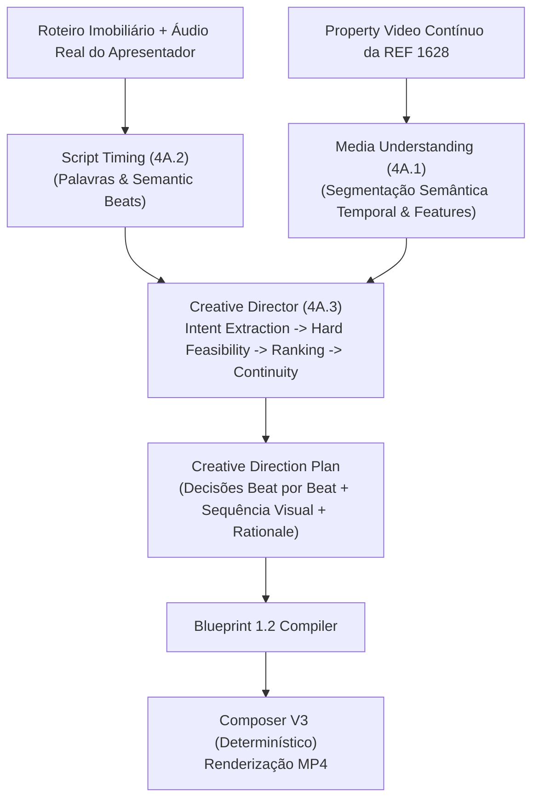
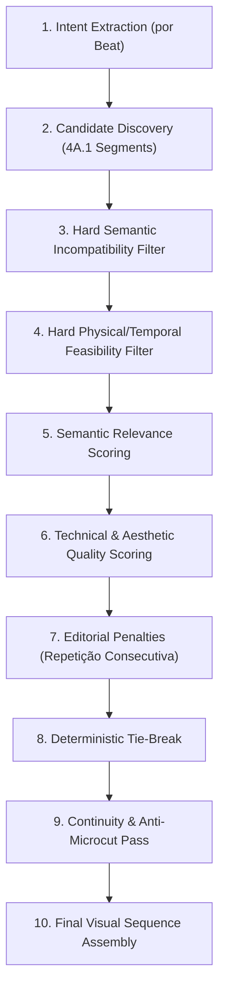

# Arquitetura e Plano de Implementação — Fase 4A.3: Semantic Matching & Creative Director Showcase (Hardened)
**Video Engine V2 — Bali Imóveis**
**Status**: Plano Hardened Submetido para Homologação e Autorização de Implementação
**Versão**: 2.0.0 (Fase 4A.3 — Hardened)

---

## 1. Visão Geral e Fronteiras de Escopo

A Fase 4A.3 conecta duas inteligências autônomas já homologadas:
1. **Media Understanding (Fase 4A.1)**: compreensão semântica temporal das mídias reais do imóvel (`media_temporal_segments` do `property_video` contínuo).
2. **Script Timing (Fase 4A.2)**: alinhamento forçado determinístico com timestamps milimétricos de palavras e semantic beats a partir do áudio real do apresentador.

O **Creative Director** da Fase 4A.3 é o motor de decisão editorial responsável por responder de forma autônoma e auditável:
> *"Dado o que está sendo falado neste exato instante do roteiro e os segmentos de vídeo contínuo disponíveis, qual é a melhor sequência visual para exibir na tela e por qual motivo editorial?"*



### 1.1 Correção de Escopo: Video-Only Semantic Matching (MVP 4A.3)
- **Escopo Exclusivo de Mídia**: O pool de mídia da Fase 4A.3 é composto **estritamente pelos segmentos temporais do Property Video** analisados e homologados na Fase 4A.1 (`media_temporal_segments`).
- **Exclusão de Fotos do CRM neste MVP**: As fotos do CRM ainda não possuem pipeline de compreensão semântica VLM homologado (sem `room_type`, `features`, `quality_scores` e `analysis_key` homologados). Nenhuma pseudo-semântica manual será criada e a ordem de fotos do CRM não será utilizada como proxy.
- **Fase Futura**: Após a homologação da 4A.3 Video-Only, uma fase dedicada de *Photo Media Understanding* será criada para habilitar a competição semântica real entre fotos e segmentos de vídeo.

---

## 2. Contratos e Schemas Formais

### 2.1 Schema do `creative_direction_plan`
Persistido de forma imutável em:
`outputs/jobs/<job_id>/creative_direction/<creative_direction_key>/direction_plan.json`

O schema suporta explicitamente **uma ou mais decisões visuais por semantic beat** (`visual_decisions`), garantindo que se um beat for longo ou exigir múltiplos takes, a cobertura temporal seja estritamente respeitada sem extrapolação de footage.

```json
{
  "schema_version": "1.0.0",
  "creative_direction_key": "SHA256_HEX_64",
  "job_id": "job_showcase_pvid_1628_...",
  "property_ref": "1628",
  "script_timing_key": "SHA256_HEX_64",
  "beat_analysis_key": "SHA256_HEX_64",
  "media_understanding_key": "SHA256_HEX_64",
  "intent_extractor_version": "1.0.0",
  "media_ranker_version": "1.0.0",
  "continuity_engine_version": "1.0.0",
  "fallback_policy_version": "1.0.0",
  "director_version": "1.0.0",
  "scoring_weights": {
    "semantic_relevance": 0.50,
    "technical_quality": 0.30,
    "aesthetic_score": 0.20
  },
  "semantic_thresholds": {
    "min_semantic_relevance": 0.40,
    "min_visual_duration_ms": 1500
  },
  "beats_count": 4,
  "beats_decisions": [
    {
      "beat_index": 0,
      "start_ms": 0,
      "end_ms": 3820,
      "duration_ms": 3820,
      "spoken_text": "Venha se encantar com esta cozinha moderna repleta de armários planejados.",
      "semantic_intent": {
        "requested_room_types": ["kitchen"],
        "requested_features": ["planned_cabinets", "modern_fixtures"],
        "visual_cues": ["kitchen", "cozinha", "armarios", "planejados"]
      },
      "evaluated_candidates": [
        {
          "candidate_id": "seg_01_kitchen",
          "asset_id": "ast_pvid_da7a726e37ad4b3f8870bad5eeffc0fe",
          "segment_index": 1,
          "media_type": "property_video_segment",
          "room_type": "kitchen",
          "features": ["porcelain_tile", "modern_fixtures", "planned_cabinets"],
          "available_start_ms": 1800,
          "available_end_ms": 7800,
          "available_duration_ms": 6000,
          "required_duration_ms": 3820,
          "is_feasible": true,
          "infeasible_reason": null,
          "semantic_relevance": 1.00,
          "technical_quality": 0.78,
          "aesthetic_score": 0.68,
          "repetition_penalty": 0.00,
          "final_match_score": 0.87,
          "selection_rationale": "Match perfeito de cômodo (kitchen) e features (planned_cabinets, modern_fixtures)"
        },
        {
          "candidate_id": "seg_05_living_room",
          "asset_id": "ast_pvid_da7a726e37ad4b3f8870bad5eeffc0fe",
          "segment_index": 5,
          "media_type": "property_video_segment",
          "room_type": "living_room",
          "features": ["bright", "furnished", "spacious"],
          "available_start_ms": 15000,
          "available_end_ms": 21000,
          "available_duration_ms": 6000,
          "required_duration_ms": 3820,
          "is_feasible": true,
          "infeasible_reason": null,
          "semantic_relevance": 0.00,
          "technical_quality": 0.78,
          "aesthetic_score": 0.68,
          "repetition_penalty": 0.00,
          "final_match_score": 0.37,
          "selection_rationale": "Descartado: cômodo incompatível (living_room vs kitchen solicitado)"
        }
      ],
      "visual_decisions": [
        {
          "timeline_start_ms": 0,
          "timeline_end_ms": 3820,
          "timeline_duration_ms": 3820,
          "selected_asset_id": "ast_pvid_da7a726e37ad4b3f8870bad5eeffc0fe",
          "selected_segment_index": 1,
          "source_in_ms": 1800,
          "source_out_ms": 5620,
          "source_duration_ms": 3820,
          "confidence": 0.95,
          "fallback_used": false,
          "fallback_type": null,
          "selection_reason": "Vencedor por maior relevância semântica (cozinha com planejados) e viabilidade física integral"
        }
      ]
    }
  ],
  "created_at": "2026-09-05T21:58:00.000Z"
}
```

---

## 3. Invariantes Físicos e Temporais Estritos

Para garantir que o Composer V3 renderize de forma 100% determinística sem falhas de decodificação:

1. **Equivalência Temporal Estrita**:
   $$\text{timeline\_duration} = \text{timeline\_end\_ms} - \text{timeline\_start\_ms}$$
   $$\text{source\_duration} = \text{source\_out\_ms} - \text{source\_in\_ms}$$
   $$\text{timeline\_duration} \equiv \text{source\_duration}$$
   *(Tolerância máxima de $\pm 2\text{ms}$ para arredondamento de frame).*

2. **Contenção Física e Semântica**:
   $$\text{source\_in\_ms} \ge \text{segment.start\_ms}$$
   $$\text{source\_out\_ms} \le \text{segment.end\_ms}$$
   $$\text{source\_in\_ms} < \text{source\_out\_ms}$$
   - O Creative Director **nunca** extrapola o arquivo físico de vídeo.
   - O Creative Director **nunca** ultrapassa as bordas do segmento semântico selecionado (evita vazar cômodo vizinho).

3. **Proibição de Manipulação Temporal Não-Determinística**:
   - O pipeline **não** faz time-stretch, aceleração, desaceleração, frame interpolation ou repetição silenciosa de footage.

---

## 4. Pipeline de Ranking e Feasibility

O motor de ranking opera em 10 etapas sequenciais e determinísticas:



### 4.1 Filtro de Incompatibilidade Semântica (Hard Filter)
- Se o cômodo do segmento não tiver qualquer correlação com o que foi pedido no beat (ex: `bathroom` quando se pediu `kitchen`), $\text{semantic\_relevance} = 0.00$.
- Candidatos com relevância zero **não podem ser selecionados** como match semântico, impedindo que uma estética bonita mostre o cômodo errado.

### 4.2 Filtro de Viabilidade Física / Temporal (`is_feasible`)
- A duração disponível do segmento $\text{available\_duration\_ms} = \text{segment.end\_ms} - \text{segment.start\_ms}$ (descontando trechos já consumidos por takes anteriores).
- Se $\text{available\_duration\_ms} < \text{required\_duration\_ms}$, o candidato é marcado como `is_feasible = false` para cobertura integral única.

### 4.3 Estratégia Quando Nenhum Take Único For Suficientemente Longo
Se um beat tiver duração $5.0\text{s}$ e o melhor segmento tiver apenas $3.6\text{s}$:
1. **Estratégia A**: Verificar se existe outro segmento semanticamente compatível com duração viável.
2. **Estratégia B (Sequência Visual de 2 Takes)**:
   - Dividir o intervalo do beat em no máximo 2 sub-intervalos visuais:
     - Take 1: Segmento A ($2.4\text{s}$)
     - Take 2: Segmento B ($2.6\text{s}$, também compatível com o tema ou cômodo complementar)
3. **Estratégia C (Presenter Completion)**:
   - Take A cobre o trecho de vídeo disponível + retorno para apresentador full-screen / PIP para completar o restante do beat.
4. **Estratégia D (Fallback Explícito)**:
   - Ativação de fallback determinístico registrado no log.

### 4.4 Fórmula de Pontuação Final e Desempate Determinístico
$$\text{final\_match\_score} = (\text{semantic\_relevance} \times 0.50) + (\text{technical\_quality} \times 0.30) + (\text{aesthetic\_score} \times 0.20) - \text{repetition\_penalty}$$

- **Penalidade de Repetição Consecutiva (`repetition_penalty = 0.25`)**:
  Aplicada se o mesmo segmento foi utilizado no beat anterior e o beat atual não é uma continuação direta de tema.
- **Desempate Determinístico (Tie-Break Order)**:
  1. `final_match_score DESC`
  2. `semantic_relevance DESC`
  3. `confidence DESC`
  4. `segment_index ASC` (menor índice = prioridade cronológica determinística)

---

## 5. Continuidade Editorial e Regras Anti-Microcorte

1. **Duração Mínima Visual (`min_visual_duration_ms = 1500ms`)**:
   - Nenhum take visual individual pode durar menos de $1.5\text{s}$.
2. **Take Extension Entre Beats Contíguos**:
   - Se o Beat $N$ e Beat $N+1$ compartilham o mesmo tema semântico, o Creative Director pode estender o take sem introduzir um corte abrupto **SE E SOMENTE SE** o segmento de vídeo contínuo tiver footage físico suficiente:
     $$\text{segment.end\_ms} - \text{current\_source\_out\_ms} \ge \text{beat}_{N+1}\text{.duration\_ms}$$
   - Se não houver footage suficiente, o sistema realiza um corte intencional para um novo take em vez de extrapolar o segmento.

---

## 6. Política de Fallback Estruturada

O Creative Director distingue formalmente entre mídias do imóvel e modos do apresentador:

| Tipo de Fallback (`fallback_type`) | Quando é Ativado | Comportamento Editorial |
| :--- | :--- | :--- |
| `generic_property_media` | Fala genérica sobre o imóvel (sem cômodo específico) com $\text{relevance} < 0.40$ | Seleciona o segmento de maior qualidade geral do vídeo (ex: fachada ou living room de alta estética) |
| `presenter_fullscreen` | Fala de gancho pessoal ou encerramento institucional ("Me chama no WhatsApp!") | Mantém apresentador Marcel em tela cheia com áudio 100% sincronizado |
| `presenter_pip` | Cobertura parcial onde o vídeo do imóvel não cobre todo o tempo | Apresentador em PIP sobrepondo o B-roll de fundo |
| `no_semantic_match` | Roteiro abstrato sem nenhuma correlação com o acervo visual | Registra flag explícita e usa melhor fallback de qualidade |

Em qualquer caso de fallback, `fallback_used = true` é registrado com `selection_reason` auditável no `direction_plan.json`.

---

## 7. Fingerprint Canônico e Cache Imutável

O `creative_direction_key` é calculado via SHA-256 sobre a canonicalização recursiva de todos os parâmetros comportamentais e versões dos submódulos:

```javascript
const canonicalObj = {
  script_timing_key: scriptTimingKey.trim().toLowerCase(),
  beat_analysis_key: beatAnalysisKey.trim().toLowerCase(),
  media_understanding_key: mediaUnderstandingKey.trim().toLowerCase(),
  intent_extractor_version: intentExtractorVersion.trim(),
  media_ranker_version: mediaRankerVersion.trim(),
  continuity_engine_version: continuityEngineVersion.trim(),
  fallback_policy_version: fallbackPolicyVersion.trim(),
  director_version: directorVersion.trim(),
  scoring_weights: canonicalizeValue(scoringWeights),
  semantic_thresholds: canonicalizeValue(semanticThresholds),
  min_visual_duration_ms: Number(minVisualDurationMs),
  schema_version: SCHEMA_VERSION
};

const canonicalJSON = canonicalStringify(canonicalObj);
const creativeDirectionKey = crypto.createHash('sha256').update(canonicalJSON, 'utf8').digest('hex');
```

Qualquer alteração em pesos, thresholds de semântica, regras de feasibility ou versões dos submódulos invalida o cache e produz uma nova chave.

---

## 8. Estratégia de Execução do Showcase Real (REF 1628)

### 8.1 Segmentos Comprovadamente Identificados na REF 1628 (Fase 4A.1)
- **Segmento 1**: `kitchen` (1.8s a 7.8s, disponível 6.0s) — *porcelain_tile, modern_fixtures, planned_cabinets* (Tech: 0.78, Aes: 0.68)
- **Segmento 4**: `balcony` / `city_view` (11.4s a 15.0s, disponível 3.6s) — *city_view* (Tech: 0.80, Aes: 0.70)
- **Segmento 5**: `living_room` (15.0s a 21.0s, disponível 6.0s) — *furnished, bright, spacious, natural_lighting* (Tech: 0.78, Aes: 0.68)
- **Segmento 8**: `bedroom` (23.4s a 28.2s, disponível 4.8s) — *wooden_floor* (Tech: 0.75, Aes: 0.60)
- **Segmento 15**: `bedroom` (40.2s a 50.8s, disponível 10.6s) — *wooden_floor, natural_lighting, city_view, planned_cabinets* (Tech: 0.70, Aes: 0.60)

### 8.2 Roteiro Imobiliário de Prova
> *"Venha se encantar com esta cozinha moderna repleta de armários planejados. A varanda ampla oferece uma vista espetacular da cidade. A sala de estar é iluminada e perfeita para receber, com dormitórios aconchegantes com piso em madeira."*

### 8.3 Origem do Áudio do Apresentador
- **Investigação Prévia**: Os jobs existentes na base de testes possuem apenas o áudio antigo genérico de IA (*"Você ainda perde horas criando vídeos..."*).
- **Diretriz de Execução**: Na futura fase de implementação, **após autorização explícita**, será realizada **UMA geração controlada** do áudio/vídeo do apresentador (avatar Marcel) para este roteiro imobiliário específico.
- **Invariante**: Em nenhuma hipótese será utilizado roteiro A com áudio B. O forced alignment da Fase 4A.2 será executado sobre o áudio genuíno do roteiro.

### 8.4 Gabarito de Avaliação Humana vs Runtime do Director
> [!IMPORTANT]
> A tabela abaixo é **exclusivamente um gabarito de avaliação humana externa (Test Oracle)**. O código do Creative Director não consome este gabarito e descobre os segmentos autonomamente a partir da intenção dos beats e do catálogo semântico da 4A.1.

| Beat # | Texto Spoken (Roteiro) | Intenção Semântica Descoberta | Gabarito Humano Esperado |
| :---: | :--- | :--- | :--- |
| **Beat 1** | *"Venha se encantar com esta cozinha moderna repleta de armários planejados."* | `kitchen`, `planned_cabinets`, `modern_fixtures` | **Segmento 1 (`kitchen`)** |
| **Beat 2** | *"A varanda ampla oferece uma vista espetacular da cidade."* | `balcony`, `city_view` | **Segmento 4 (`balcony/city_view`)** |
| **Beat 3** | *"A sala de estar é iluminada e perfeita para receber,"* | `living_room`, `natural_lighting`, `spacious` | **Segmento 5 (`living_room`)** |
| **Beat 4** | *"com dormitórios aconchegantes com piso em madeira."* | `bedroom`, `wooden_floor` | **Segmento 8 ou 15 (`bedroom`)** |

---

## 9. Matriz de Testes Formais Prevista (Cenários A a Z)

A suíte `tests/video_engine/creative_director_tests.js` cobrirá 26 cenários formais:

- **Cenário A**: Extração determinística de `semantic_intent` a partir do texto do beat
- **Cenário B**: Relevância semântica com prioridade estrita sobre qualidade estética
- **Cenário C**: Ranking reproduzível com pesos parametrizados (0.50 / 0.30 / 0.20)
- **Cenário D**: Video-only candidate discovery a partir do catálogo 4A.1
- **Cenário E**: Cálculo exato de `source_in_ms` e `source_out_ms` respeitando limites do segmento
- **Cenário F**: Aplicação determinística de penalidade por repetição consecutiva (-0.25)
- **Cenário G**: Prevenção de microcortes (`min_visual_duration_ms >= 1500ms`)
- **Cenário H**: Ativação e rastreabilidade de fallback determinístico com registro de motivo
- **Cenário I**: Determinismo matemático de `creative_direction_key` e Cache Hit
- **Cenário J**: Invalidação de cache ao alterar pesos (`scoring_weights`)
- **Cenário K**: Compilação sem perdas do `creative_direction_plan` para Creative Blueprint 1.2
- **Cenário L**: Renderização fim-a-fim no Composer V3 e preservação de integridade de áudio
- **Cenário M**: Candidato com duração disponível menor que o beat é marcado como `is_feasible = false`
- **Cenário N**: Candidato marcado como infeasible nunca vence o ranking de cobertura única
- **Cenário O**: `source_out_ms` nunca extrapola o final físico do segmento semântico
- **Cenário P**: Invariante temporal estrito: `timeline_duration === source_duration` em todas as decisões
- **Cenário Q**: Beat longo sem take único viável gera sequência visual de 2 takes ou fallback
- **Cenário R**: Take extension entre beats contíguos respeita o footage físico restante do segmento
- **Cenário S**: O gabarito humano da REF 1628 não é consumido pelo runtime do Director
- **Cenário T**: `creative_direction_key` é invalidada ao mudar `intent_extractor_version`
- **Cenário U**: `creative_direction_key` é invalidada ao mudar `min_semantic_relevance` threshold
- **Cenário V**: `creative_direction_key` é invalidada ao mudar `min_visual_duration_ms`
- **Cenário W**: Desempate determinístico (tie-break) produz o mesmo vencedor em 100% das execuções
- **Cenário X**: MVP Video-Only não depende de propriedades de foto inexistentes
- **Cenário Y**: Roteiro e áudio com token coverage divergente (<90%) são rejeitados antes do Director
- **Cenário Z**: Sequência visual gerada cobre o intervalo total do áudio sem gaps ou overlaps

---

## 10. Arquivos Previstos para a Fase de Implementação

### Novos Módulos:
1. `video_engine/creative_director/creative_direction_schema.js`
2. `video_engine/creative_director/intent_extractor.js`
3. `video_engine/creative_director/media_ranker.js`
4. `video_engine/creative_director/editorial_continuity_engine.js`
5. `video_engine/creative_director/creative_director_service.js`
6. `tests/video_engine/creative_director_tests.js`

### Arquivos Intocados:
- `video_engine/composer_service.js` (Composer V3)
- `video_engine/property_media/*` (Ingestão de Mídia)
- `video_engine/media_understanding/*` (Fase 4A.1)
- `video_engine/script_timing/*` (Fase 4A.2)
